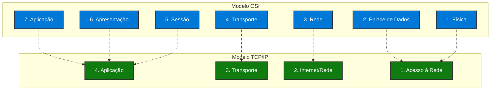
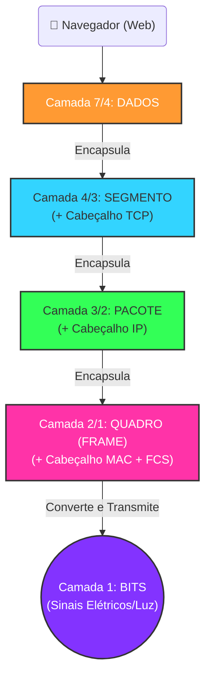
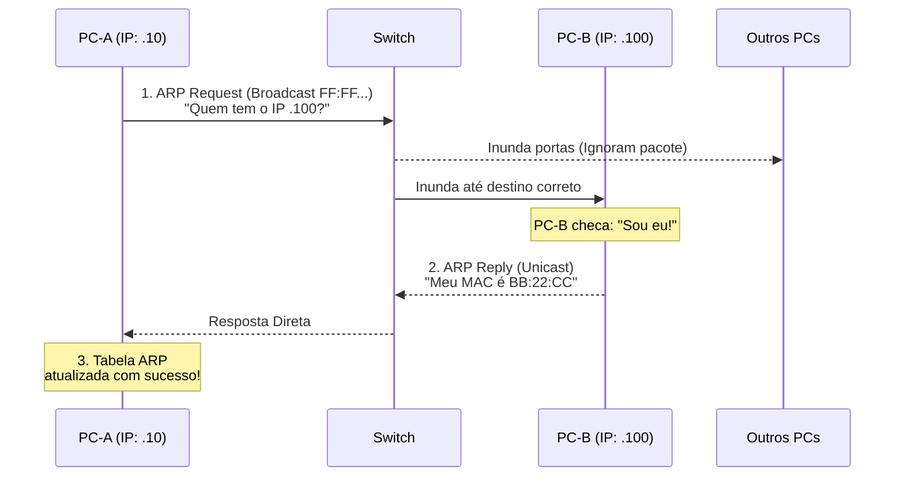

# Aula 05: Modelo OSI vs. TCP/IP, ARP e Prática no Packet Tracer

> **Disciplina:** Redes de Computadores I (Cód. 49325) | **Curso:** Sistemas de Informação, Uniube | **Semana 4** | 09/03/2026 | Prof. Romualdo Mathias Filho
> 

---

## **🎯 0. Objetivo da Aula**

Ao final desta aula, o aluno deve ser capaz de:

- **Comparar** a estrutura teórica do modelo OSI com a arquitetura prática do modelo TCP/IP.
- **Entender detalhadamente** os processos de encapsulamento e desencapsulamento (A Jornada do Pacote).
- **Compreender** a função do protocolo ARP para integração entre as camadas de Rede (IP) e Enlace (MAC).
- **Aplicar comandos e simulações** utilizando a ferramenta Cisco Packet Tracer, validando na prática o comportamento dos protocolos estudados.

---

## **🔄 1. Recapitulação**

| **Aula** | **Conceito** | **Definição** |
| --- | --- | --- |
| 04 | Camada Física | Transmissão de bits brutos pelo cabeamento/meio sem fio (Sinal elétrico, RF, luz). |
| 04 | Camada de Enlace | Entrega confiável de quadros (frames) entre nós locais adjacentes. |
| 04 | Endereço MAC | Identificador físico de 48 bits, gravado na placa de rede, usado na rede local. |
| 04 | Switch | Equipamento de camada 2 que encaminha quadros consultando sua Tabela MAC. |

> **Conexão:** Na última aula exploramos profundamente as camadas 1 e 2. Vimos como dispositivos locais “conversam”. Mas e quando queremos acessar um site do outro lado do mundo, e a comunicação passa por múltiplos roteadores? É aí que a pilha de protocolos inteira atua, e é exatamente como tudo isso se organiza que veremos hoje, focando na união de teoria (Modelos OSI e TCP/IP) e **prática guiada (Packet Tracer)**.
> 

---

## **🏗️ 2. Modelos de Referência: OSI vs. TCP/IP**

Existem dois grandes modelos que padronizam a arquitetura de redes. O modelo OSI é o nosso mapa teórico de 7 camadas, mas o mundo real roda essencialmente sobre a arquitetura TCP/IP de 4 (ou 5, dependendo dos autores) camadas.

### **📌 Tabela Comparativa direta**



| **Camada OSI (7 camadas)** | **Camada TCP/IP (4 camadas)** | **Unidade de Protocolo (PDU)** | **Exemplos de Protocolos** |
| --- | --- | --- | --- |
| 7. Aplicação | **4. Aplicação** | Mensagem / Dados | HTTP, DNS, SMTP, FTP |
| 6. Apresentação | (Incluída na Aplicação) | Mensagem / Dados | SSL, TLS |
| 5. Sessão | (Incluída na Aplicação) | Mensagem / Dados | NetBIOS |
| 4. Transporte | **3. Transporte** | Segmento | TCP, UDP |
| 3. Rede | **2. Internet (Rede)** | Pacote (Packet) | IPv4, IPv6, ICMP, IPsec |
| 2. Enlace de Dados | **1. Acesso à Rede (Enlace/Física)** | Quadro (Frame) | Ethernet, Wi-Fi, MAC, ARP |
| 1. Física | (Lida em conjunto c/ Acesso) | Bits | 1000BASE-T, Cabos metálicos |

> **Observação Pedagógica:** Alguns autores modernos (como Kurose e Tanenbaum) usam uma visão do TCP/IP baseada em 5 camadas (separando Enlace e Física) apenas por fins didáticos para dar as aulas de rede de forma sequencial.
> 

---

## **📦 3. A Jornada do Pacote: Encapsulamento**

A comunicação através dos modelos de referência ocorre por **encapsulamento** na origem, e por **desencapsulamento** no destino. É o ato de envelopar informações de uma camada dentro da outra.

**O passo a passo (Origem / Envio):**



1. **Camada de Aplicação:** O seu navegador gera o “Dado” (ex: requisição web).
2. **Camada de Transporte:** Pega esse dado e coloca num envelope chamado **Segmento**. Adiciona o cabeçalho TCP (com porta de origem e destino).
3. **Camada de Rede:** Pega o segmento e coloca em um envelope chamado **Pacote**. Adiciona no cabeçalho o Endereço IP de origem e do destino final.
4. **Camada de Enlace:** Pega o pacote IP e coloca num envelope chamado **Quadro (Frame)**. Adiciona o Endereço MAC de origem e do destino do **próximo salto** (ex: o seu gateway roteador de casa).
5. **Camada Física:** Converte esse quadro Ethernet inteiro numa corrente eletromagnética ou de luz (bits).

**O passo a passo (Destino / Recebimento):**
- A rede recebe bits → Remonta o Quadro e confere o MAC → Descarta o quadro e olha para o Pacote → Lê os IPs → Descarta o pacote e olha para o Segmento → Lê a porta (ex: 80 -> WebServer) → Entrega os Dados à Aplicação correta.

---

## **🔍 4. O Elo Perdido: O Protocolo ARP**

Nós sabíamos o IP do roteador (camada 3), mas para colocar o pacote no quadro Ethernet (camada 2), precisamos do MAC da interface daquele roteador. Como descobrir?

**Definição:** O **ARP (Address Resolution Protocol)** é responsável por mapear (traduzir) um endereço IP conhecido em um endereço MAC desconhecido dentro da mesma rede local.

**Como funciona (A Dinâmica do “Quem é?”):**



1. PC-A quer conversar com PC-B, que tem o IP `192.168.1.100`.
2. PC-A sabe o IP, mas **não tem o MAC** na sua tabela (Cache ARP).
3. PC-A envia um quadro de **Broadcast MAC** (`FF:FF:FF:FF:FF:FF`), ou seja, grita para toda a rede (switch inunda a porta):
*▶ MENSAGEM ARP:* *“Quem aqui tem o IP 192.168.1.100? Por favor responda para o meu MAC e meu IP!”*
4. O PC-B (e só ele) percebe que o pacote é para ele, e **responde diretamente via Unicast** de volta para o MAC do PC-A:
*▶ RESPOSTA ARP:* *“Eu sou o IP 192.168.1.100 e aqui está meu MAC: 00:AA:11:BB:22:CC”*
5. PC-A processa, guarda a info no cache ARP, e agora consegue envelopar o quadro de IP no Ethernet!

> **Dica Prática:** No Packet Tracer (modo Simulation), o ARP Request aparece como envelope laranja. Clique nele ao sair do PC0 e observe o campo `Dest MAC = FFFF.FFFF.FFFF` (Broadcast) na aba **Outbound PDU Details**.
> 

---

## **🛠️ 5. Laboratório Prático (Packet Tracer)**

*(Metade final da aula será dedicada EXCLUSIVAMENTE ao uso da ferramenta pela turma).*

> **Aviso de Professor:** *A teoria de encapsulamento costuma voar da mente rápido quando não pegamos com as próprias mãos. A mágica do Packet Tracer está no modo de Simulação, onde conseguimos colocar a rede em câmera lenta e ver cada bit e cabeçalho.*
> 

### **📌 Atividade 1: Observando Tabelas MAC de um Switch a Bordo**

**Objetivo:** Verificar como um Switch aprende os MACs baseado no que explicamos na Aula 04.
1. Abra o Packet Tracer e adicione **1 Switch 2960** e **3 PCs** (PC0, PC1, PC2).
2. Conecte os PCs nas interfaces `FastEthernet 0/1`, `0/2` e `0/3` do Switch usando Cabos de Cobre Direto (Straight-Through).
3. Atribua IPs aos PCs (Ex: PC0: `192.168.1.10`, PC1: `192.168.1.11`, PC2: `192.168.1.12`).
4. Clique no Switch > Vá na Aba CLI. Pressione ENTER até ver o prompt `Switch>`.
5. Digite:
- `enable`
- `show mac address-table` *(Pode constatar que está vazia no início).*
6. No PC0, faça ping para o PC1: (Desktop > Command Prompt > `ping 192.168.1.11`).
7. Volte ao Switch e digite `show mac address-table` novamente. O que aconteceu?
*Explicação prática:* O Switch ativamente aprendeu as origens e guardou dinamicamente as portas!

---

### **📌 Atividade 2: Simulando a Jornada do Pacote e o ARP**

**Objetivo:** Capturar o “envelope” no exato momento da transmissão e observar a “Mágica do ARP”.
1. Com a topologia montada da Atividade 1, no Packet Tracer, altere do modo **Realtime** (canto inferior direito) para o modo **Simulation**.
2. Clique no botão de **Edit Filters** na janela de simulação e marque apenas `ICMP` e `ARP`. O resto deixe desmarcado para reduzir o barulho visual.
3. No PC0 (Command Prompt), limpe a tabela de ARP do host com o comando:
- `arp -d` *(Força que ele esqueça os endereços).*
4. Emita o comando `ping 192.168.1.12` (para PC2).
5. Você notará que o Packet Tracer irá gerar **DOIS pacotinhos (envelopes)** sobre o PC0 antes de enviar. Um é de uma cor, que é o ICMP travado em espera, e o outro é o Pacote ARP.
6. Dê o Play (`Capture / Forward` passo a passo).
7. Clique sobre o envelopinho de ARP quando ele sair do PC0:
- Navegue na guia **Inbound PDU Details** e **Outbound PDU Details**.
- Mostre como o `Dest MAC` está todo como `FFFF.FFFF.FFFF` (Broadcast)!!
8. Reveja o pacote ARP ir, ser ignorado por PC1 e ser respondido pelo PC2 até a origem (PC0).
9. Mande avançar novamente e note que agora sim o pacote ICMP (cor diferente) prosseguirá porque o Enquadramento da Camada 2 finalmente foi viabilizado graças ao ARP.

---

### **📌 Atividade 3: Dissecando o Encapsulamento (Anatomia do PDU)**

**Objetivo:** Ver as 7 (ou 4) camadas funcionando em um pacote no Packet Tracer.
1. Pegue um envelopinho de um ping (ICMP) sendo recebido/transmitido em um PC do modo Simulation da Atividade 2.
2. Na janela de PDU Information, clique na guia **OSI Model**.
3. Peça para reparem do lado direito (“Out Layers”) ou esquerdo (“In Layers”):
- Como a **Layer 3 (IP)** descreve os Src. e Dst. IP de ponta a ponta.
- Como a **Layer 2 (Ethernet II)** descreve o pacote com o Preamble, MACs, etc.
- Como ele indica exatamente qual porta a camada 1 (Port) está transmitindo os dados elétricos e o valor da banda (`Layer 1: FastEthernet`).

*Reflexão para a Turma:* “E quando houver um roteador no meio de dois continentes? O Layer 3 (IP) muda? E o Layer 2 (MAC)? Vamos testar os limites do rastreio!”

---

## **🚀 6. Desafio Prático & Sala de Aula Invertida**

**Missões para o Aluno (Treino no Packet Tracer e Preparo Semanal):**

1. Reproduza em casa o Laboratório 1 e 2 sozinhos, e respondam como questionário:
    - O comando `arp -a` no terminal do Windows tem a mesma sintaxe do Packet Tracer? O que ele retorna na sua máquina real agora? Verifique IPs do seu gateway (Roteador Wi-Fi) emparelhado com o MAC do roteador.
2. **Leitura de Contexto:** Como o IPv4 faz para dividir computadores? Para nossa próxima aula (Redes IPv4 Cap. 4 Tanenbaum / Cap. 4 Kurose), estudaremos *Endereçamento IP (Classes, Máscaras e introdução de Roteamento).* Pesquisem: o que significam os termos `IP Público` vs. `IP Privado` e a técnica chamada `NAT`? Serão cruciais.

---

## **📋 7. Resumo Estrutural**

| **Conceito** | **Definição em Uma Frase** |
| --- | --- |
| **Modelo OSI** | Modelo de referência teórico com 7 camadas que padroniza a comunicação em redes |
| **Modelo TCP/IP** | Arquitetura real de 4 camadas usada na Internet moderna |
| **Encapsulamento** | Processo de envolver os dados de uma camada superior em um envelope da camada inferior |
| **Desencapsulamento** | Remoção dos cabeçalhos camada por camada no dispositivo de destino |
| **PDU** | Protocol Data Unit — unidade de dados em cada camada (Mensagem, Segmento, Pacote, Quadro, Bit) |
| **ARP** | Protocolo que traduz um endereço IP em um endereço MAC dentro da mesma rede local |
| **ARP Request** | Mensagem Broadcast enviada para descobrir o MAC associado a um IP desconhecido |
| **ARP Reply** | Resposta Unicast contendo o MAC do dispositivo que possui o IP solicitado |
| **Cache ARP** | Tabela local que guarda temporariamente os mapeamentos IP → MAC já resolvidos |
| **Modo Simulation** | Recurso do Packet Tracer que exibe PDUs “viajando” pela rede passo a passo |

---

## **🧩 8. Exercícios (PBL)**

### **Parte A — Questões de Múltipla Escolha / Verdadeiro ou Falso**

**Q1. (OSI vs. TCP/IP)**
Um desenvolvedor afirma que o TCP/IP tem 4 camadas; seu colega insiste em 5. Ambos podem estar corretos?

- **a)** Sim. Depende se a Camada Física é separada da de Enlace ou agrupada como “Acesso à Rede”.
- **b)** Não. O TCP/IP sempre teve exatamente 4 camadas.
- **c)** Sim. Depende se a Camada de Aplicação incorpora ou não Sessão e Apresentação.
- **d)** Não. O TCP/IP é padronizado com 7 camadas pelo IEEE.

> **Gabarito:** **A** — O TCP/IP pode ser apresentado com 4 ou 5 camadas conforme o autor. Ambas as visões são aceitas na literatura de redes.
> 

---

**Q2. (Encapsulamento — Ordenação)**
Numere a sequência CORRETA para o envio de uma requisição HTTP:

| **Ordem** | **Ação** |
| --- | --- |
| ( ) | O payload é convertido em bits para transmissão pelo cabo |
| ( ) | O HTTP gera os Dados e os entrega à pilha TCP/IP |
| ( ) | O cabeçalho TCP (porta 80) é adicionado → forma o Segmento |
| ( ) | O cabeçalho Ethernet (MACs de origem e próximo salto) é adicionado → forma o Quadro |
| ( ) | O cabeçalho IP (IPs de origem e destino) é adicionado → forma o Pacote |

> **Gabarito:** 5 – 1 – 2 – 4 – 3 *(Dados → Segmento → Pacote → Quadro → Bits)*
> 

---

**Q3. (ARP — Verdadeiro ou Falso)**
PC-A (`192.168.1.10`) quer enviar dados para PC-C (`192.168.1.30`) com o cache ARP vazio:

| **#** | **Afirmativa** | **V/F** |
| --- | --- | --- |
| 1 | PC-A enviará um ARP Request com MAC destino `FF:FF:FF:FF:FF:FF`. |  |
| 2 | Apenas PC-C responde ao ARP Request, via Unicast, com seu MAC. |  |
| 3 | PC-B (`192.168.1.20`) descarta o ARP Request sem nem recebê-lo. |  |
| 4 | Após a resolução ARP, os próximos pacotes para PC-C dispensam novo ARP (enquanto o cache não expirar). |  |
| 5 | O ARP opera exclusivamente na Camada 4 (Transporte) do modelo OSI. |  |

> **Gabarito:** **V, V, F** *(PC-B recebe e processa, mas descarta ao constatar que não é o destino)*, **V, F** *(ARP opera na interface entre Camadas 2 e 3)*
> 

---

**Q4. (Roteamento e PDU)**
Quando um Pacote IP atravessa um **roteador** entre duas redes distintas, o que se altera?

- **a)** O IP de destino muda a cada salto, substituído pelo IP do roteador.
- **b)** Apenas os endereços MAC mudam a cada salto; os IPs de ponta a ponta permanecem inalterados.
- **c)** Tanto IPs quanto MACs são substituídos a cada salto pelo roteador.
- **d)** O MAC de destino permanece o mesmo do destinatário final em toda a jornada.

> **Gabarito:** **B** — O IP identifica origem e destino finais (ponta a ponta) e nunca muda. O MAC identifica apenas o **próximo salto** e é recriado a cada roteador. Esta é uma das questões mais frequentes em provas de Redes.
> 

---

**Q5. (PDU — Identificação de Camadas)**
Relacione cada unidade de dados (PDU) com a camada OSI correspondente:

| **PDU** | **Camada OSI** |
| --- | --- |
| Segmento | ( ) Camada 1 — Física |
| Quadro (Frame) | ( ) Camada 2 — Enlace |
| Bit | ( ) Camada 3 — Rede |
| Pacote | ( ) Camada 4 — Transporte |
| Mensagem/Dado | ( ) Camadas 5–7 — Sessão/Apresentação/Aplicação |

> **Gabarito:** Bits → C1, Quadro → C2, Pacote → C3, Segmento → C4, Mensagem → C5–7
> 

---

### **Parte B — Exercício Prático no Packet Tracer**

**Cenário:** Monte a seguinte topologia:

```
[PC0: 192.168.1.10] ---+
[PC1: 192.168.1.20] ---+--- [Switch 2960] --- [PC3: 192.168.1.40]
[PC2: 192.168.1.30] ---+
```

**Tarefas:**

1. **Configure** os IPs em todos os PCs e verifique conectividade com `ping` entre PC0 e PC3.
2. **Tabela MAC:** Execute `show mac address-table` no switch antes e depois dos pings. Quantas entradas foram aprendidas? Por quê?
3. **Modo Simulation (filtro: ARP + ICMP):** Execute `ping 192.168.1.40` a partir do PC0. Registre:
    - Qual é o `Dest MAC` no ARP Request?
    - Qual é o `Src MAC` no ARP Reply?
    - Por quais portas o Switch encaminhou o ARP Request?
4. **(Desafio):** Execute `arp -d` no PC0 e repita o ping. O Switch fez flooding novamente? Por quê?
5. **(Reflexão Escrita — 3 a 5 linhas):** Explique com suas palavras por que o endereço MAC muda a cada roteador, mas o IP de destino permanece o mesmo durante toda a jornada do pacote.

---

## **🚀 9. Sala de Aula Invertida (Próxima Aula)**

**Para a próxima aula (Semana 5: Endereçamento IPv4, Máscaras e Sub-redes):**

1. Pesquise o que são **endereços IPv4 públicos** e **privados** (RFC 1918). Anote os três blocos de IP privado.
2. Explique com suas palavras o que é **NAT (Network Address Translation)** e por que ele é necessário na Internet atual.
3. **Experimento real:** Execute `ipconfig /all` no seu computador. Identifique o IP, a máscara de sub-rede e o gateway padrão. O IP é público ou privado?
4. **(Opcional avançado):** O que é **CIDR**? Qual a diferença entre `192.168.1.0/24` e `192.168.1.0/26`? Quantos hosts cabem em cada uma?

> **Dica:** Consulte Tanenbaum, Cap. 5 (Seção 5.4: Sub-redes) e Kurose, Cap. 4 (Seção 4.3: Endereçamento IPv4).
> 

---

## **📚 10. Referências Bibliográficas**

### **📖 Referências Obrigatórias**

| **Autor** | **Obra** | **Capítulo/Seção Utilizada** |
| --- | --- | --- |
| TANENBAUM, A. S.; FEAMSTER, N.; WETHERALL, D. J. | Redes de Computadores. 6. ed. Pearson, 2021 | Cap. 1 (Seção 1.4: Modelos de Referência), Cap. 5 (ARP e Endereçamento) |
| KUROSE, J. F. | Redes de Computadores e a Internet. 8. ed. Pearson, 2021 | Cap. 1 (Seção 1.5: Camadas Protocolares), Cap. 6 (Seção 6.4: ARP) |
| CISCO NETWORKING ACADEMY | Curso CCNAv7: Introduction to Networks | Módulos: Modelo OSI/TCP, ARP, Packet Tracer Labs |

### **🔗 Links Úteis e Materiais Complementares**

- [Download Cisco Packet Tracer Oficial](https://www.netacad.com/courses/packet-tracer)
- [RFC 826: Especificação oficial do ARP](https://datatracker.ietf.org/doc/html/rfc826)
- [RFC 1918: Espaços de endereços privados IPv4](https://datatracker.ietf.org/doc/html/rfc1918)