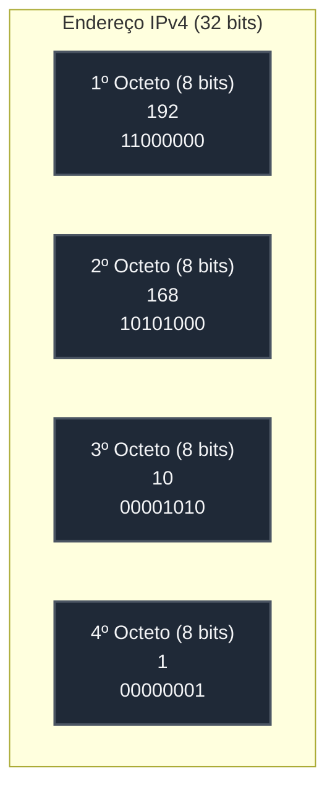

# 🟢 Aula 06: Endereçamento IPv4, Máscaras e Prática no Packet Tracer

**Disciplina:** Redes de Computadores I (Cód. RED-01)  
**Curso:** Engenharia / TI — Uniube  
**Semana:** 6  
**Professor:** Romualdo Mathias Filho  
**Tipo:** 🔬 Teórico-Prática  

---

> 💬 *"A compreensão teórica dos bits de um endereço IP e de suas máscaras é a fundação da engenharia de tráfego. A prática de laboratório em simulador é o que dá vida a essa teoria, transformando fórmulas matemáticas em conexões reais."*

---

## 🎯 Objetivo da Aula

Ao final desta aula, os alunos serão capazes de:
- **Compreender** a estrutura lógica de 32 bits de um endereço IPv4, convertendo facilmente representações decimais pontuadas em binário.
- **Diferenciar** a parte de rede (Network ID) e a parte de host (Host ID) em um endereço IP.
- **Classificar** endereços IPv4 nas classes clássicas (A, B, C, D e E) e identificar os limites de cada faixa.
- **Identificar** endereços IPs reservados de uso especial, tais como loopback, broadcast local, broadcast direcionado e faixas privadas da RFC 1918.
- **Explicar** o funcionamento bit a bit de uma máscara de sub-rede utilizando a operação lógica AND.
- **Calcular** sub-redes utilizando notação CIDR de prefixos e projetar planos com o método VLSM (Variable Length Subnet Mask).
- **Montar e Configurar** computadores, switches e interfaces de roteadores Cisco (via CLI) com IPs estáticos e escopo DHCP dinâmico no Cisco Packet Tracer.

---

## 🔄 Revisão Rápida (5 min)

| **Conceito e Link de Origem** | **Conexão com a Aula de Hoje** |
| :--- | :--- |
| **[[Aula 03 - Topologias e Meios\|Aula 03 (Topologias)]]** | Vimos o hardware e as conexões físicas. Hoje, estruturaremos a topologia cabeada Ethernet no simulador. |
| **[[Aula 04 - Camada Fisica e Enlace\|Aula 04 (Camada Física)]]** | Analisamos os switches da camada 2 e a tabela de endereços MAC. Hoje, interligaremos esses switches a um roteador de camada 3. |
| **[[Aula 05 - Modelo OSI vs TCP IP\|Aula 05 (Modelo OSI vs. TCP/IP)]]** | Estudamos o fluxo de encapsulamento e a jornada lógica de um pacote IP. Hoje, faremos essa jornada física e inter-redes funcionar. |

---

## 📌 1. A Estrutura do Endereço IPv4, Classes e IPs Reservados [Teoria ⏳ 15 min]

O **Internet Protocol version 4 (IPv4)** é o protocolo padrão da Camada de Rede (Internet) responsável pelo endereçamento lógico e pelo roteamento de pacotes na rede mundial de computadores.

### 1.1 — Representação Binária vs. Decimal Pontuado

Um endereço IPv4 é uma sequência lógica de **32 bits** (sinais binários 0 e 1). Para facilitar a leitura humana, esses 32 bits são divididos em **quatro octetos** (grupos de 8 bits) separados por pontos. Esta notação é chamada de **Decimal Pontuado**.



Cada bit em um octeto possui um peso posicional baseado em potências de 2, variando de $2^7$ (128) a $2^0$ (1). O valor decimal de cada octeto varia de **0 a 255**.

### 1.2 — Divisão Hierárquica: Rede vs. Host

Todo endereço IP é dividido logicamente em duas partes fundamentais:
1. **Parte de Rede (Network ID):** Identifica a rede específica à qual o dispositivo pertence. Todos os dispositivos na mesma sub-rede física devem compartilhar a mesma identificação de rede.
2. **Parte de Host (Host ID):** Identifica de forma única o dispositivo individual (computador, switch, interface do roteador, impressora) dentro daquela rede específica.

### 1.3 — Classes Clássicas e IPs Especiais (RFC 1918)

| Classe | Intervalo do 1º Octeto | Máscara Padrão | Quantidade de Sub-redes | Hosts por Rede | Uso Principal |
| :--- | :--- | :--- | :--- | :--- | :--- |
| **A** | `1.0.0.0` a `126.255.255.255` | `255.0.0.0` (/8) | 128 | ~16,7 Milhões | Organizações e Redes Globais |
| **B** | `128.0.0.0` a `191.255.255.255` | `255.255.0.0` (/16) | 16.384 | 65.534 | Redes Corporativas Médias |
| **C** | `192.0.0.0` a `223.255.255.255` | `255.255.255.0` (/24)| ~2 Milhões | 254 | Redes Domésticas e Pequenas |
| **D** | `224.0.0.0` a `239.255.255.255` | Sem máscara padrão | - | Multicast | Transmissão de Grupo (Streaming/IPTV) |
| **E** | `240.0.0.0` a `255.255.255.255` | Sem máscara padrão | - | Experimental | Reservado para Pesquisas IETF |

*   **Loopback (Localhost) — `127.0.0.1`:** Usado para testes de loop de software local no próprio computador.
*   **IPs Privados (RFC 1918):** De livre uso local, não são roteáveis na Internet pública, usados para estruturar redes locais:
    *   **Classe A Privada:** `10.0.0.0` a `10.255.255.255`
    *   **Classe B Privada:** `172.16.0.0` a `172.31.255.255`
    *   **Classe C Privada:** `192.168.0.0` a `192.168.255.255`

> [!TIP] 💡 Dica de Produção (Pro-Tip)
> Em grandes corporações como a **Nubank** ou na nuvem de produção do **iFood**, os engenheiros estruturam seus data centers e ambientes de Cloud Computing (VPCs na AWS ou GCP) inteiros utilizando a faixa **Classe A Privada (`10.0.0.0/8`)**. Isso fornece milhões de IPs internos livres de conflitos de Internet. O acesso seguro de saída à Internet pública é feito através de **Gateways NAT (Network Address Translation)**, reduzindo custos de IPs públicos estáticos e ocultando a infraestrutura interna contra ataques externos direcionados.

---

## 📌 2. Máscaras de Rede, CIDR e Cálculo de Sub-redes [Teoria ⏳ 15 min]

A máscara de sub-rede é o elemento crucial de 32 bits que **informa aos roteadores e hosts quais bits de um IP pertencem à rede e quais pertencem ao host**.

### 2.1 — A Operação Lógica AND

Dispositivos de rede realizam uma operação binária **AND (E lógico)** entre o endereço IP e a Máscara para extrair o endereço de rede correspondente. No AND, o resultado só é 1 se ambos os bits comparados forem 1:

```markdown
IP:       192.168.10.74   ->  11000000.10101000.00001010.01001010
Máscara:  255.255.255.0   ->  11111111.11111111.11111111.00000000
-------------------------------------------------------------------
Rede:     192.168.10.0    ->  11000000.10101000.00001010.00000000
```

### 2.2 — Notação CIDR e Fórmulas de Sub-rede

A notação **CIDR** simplifica essa escrita utilizando uma barra (`/`) seguida pelo número de bits consecutivos que estão ativados (com o valor 1) na máscara (ex: `/24` = `255.255.255.0`, `/26` = `255.255.255.192`).
Para projetar e calcular sub-redes, utilizamos duas fórmulas fundamentais:
1.  **Quantidade Total de Hosts por Sub-rede:** $Hosts = 2^h - 2$ *(Onde $h$ é o número de bits de host).*
2.  **Quantidade de Sub-redes Possíveis:** $Subredes = 2^s$ *(Onde $s$ representa o número de bits "emprestados" da máscara de rede padrão).*

> [!WARNING] ⚠️ Gotcha de Infraestrutura
> O erro mais comum de analistas juniores de infraestrutura é tentar interligar duas filiais de uma empresa cujas sub-redes locais usam o exato mesmo intervalo de IP Privado (ex: ambas usam `192.168.1.0/24 VPN`). Isso gera uma **colisão de rotas (overlap)**, impossibilitando que os roteadores saibam para qual ponta enviar os pacotes, pois as duas redes são logicamente idênticas.

---

## 📌 3. Laboratório Prático: Topologia e Endereçamento Estático [Hands-On ⏳ 30 min]

Nesta seção prática, utilizaremos o software Cisco Packet Tracer para projetar uma topologia física local e configurar o endereçamento estático nas estações.

### 3.1 — Exercício 1: Montagem da Topologia Física

Construiremos a infraestrutura básica composta por dois segmentos físicos distintos que serão interligados fisicamente por um roteador central:

```
  [PC0] ---+                             +--- [PC2]
  [PC1] ---+--- [Switch0] --- [R0] ------+--- [PC3]
                          (Roteador)

  Rede A: 192.168.10.0/24         Rede B: 192.168.20.0/24
```

1. Abra o Cisco Packet Tracer.
2. Adicione os seguintes equipamentos no workspace:
   - **2x Switches** do modelo Cisco Catalyst **2960**.
   - **1x Roteador** do modelo Cisco **2911** (ou ISR4331).
   - **4x PCs** genéricos.
3. Realize a interconexão utilizando **cabos de cobre direto (Straight-Through)**:
   - `PC0 (Fa0)` para `Switch0 (Fa0/1)`
   - `PC1 (Fa0)` para `Switch0 (Fa0/2)`
   - `PC2 (Fa0)` para `Switch1 (Fa0/1)`
   - `PC3 (Fa0)` para `Switch1 (Fa0/2)`
   - `Switch0 (Gig0/1)` para o roteador `R0 (Gig0/0)`
   - `Switch1 (Gig0/1)` para o roteador `R0 (Gig0/1)`
4. Salve o arquivo com o nome `Aula06_Laboratorio.pkt`.

### 3.2 — Exercício 2: Endereçamento Estático da Rede A

Configuraremos as estações pertencentes ao segmento **Rede A** utilizando endereços privados estáticos Classe C:

| **Dispositivo** | **Endereço IP** | **Máscara de Sub-rede** | **Gateway Padrão** |
| :--- | :--- | :--- | :--- |
| **PC0** | `192.168.10.10` | `255.255.255.0` | `192.168.10.1` |
| **PC1** | `192.168.10.11` | `255.255.255.0` | `192.168.10.1` |

1. Clique no **PC0** -> aba **Desktop** -> menu **IP Configuration**.
2. Marque a opção **Static** e insira os dados de IP, máscara e gateway descritos na tabela acima.
3. Repita o procedimento no **PC1**.
4. Abra o Command Prompt do PC0 e teste a conectividade com seu vizinho executando: `ping 192.168.10.11`. O ping deve ter sucesso completo.

### 3.3 — Exercício 3: Endereçamento Estático da Rede B

Configuraremos as estações do segmento **Rede B**:

| **Dispositivo** | **Endereço IP** | **Máscara de Sub-rede** | **Gateway Padrão** |
| :--- | :--- | :--- | :--- |
| **PC2** | `192.168.20.10` | `255.255.255.0` | `192.168.20.1` |
| **PC3** | `192.168.20.11` | `255.255.255.0` | `192.168.20.1` |

1. Aplique os dados da tabela acima nas estações **PC2** e **PC3**.
2. Valide o tráfego local entre eles executando ping do PC2 para o PC3 (`ping 192.168.20.11`).
3. Tente pingar do PC2 para o PC0 (`ping 192.168.10.10`).
   *Observe que o ping falhará ("Request timed out"), pois as interfaces do roteador que servem de gateway ainda não estão configuradas e ativas.*

---

## 📌 4. Laboratório Prático: CLI Cisco, Roteamento e DHCP [Hands-On ⏳ 60 min]

Nesta etapa, ativaremos as portas do roteador `R0` como gateway das sub-redes e ativaremos os serviços dinâmicos na CLI.

### 4.1 — Exercício 4: Ativação das Interfaces do Roteador (CLI)

1. Clique no roteador **R0** -> selecione a aba **CLI**.
2. Responda `no` se for questionado sobre iniciar o assistente. Pressione ENTER.
3. Configure os IPs de gateway nas interfaces GigabitEthernet do roteador Cisco IOS:

```ios
Router> enable
Router# configure terminal
Router(config)# interface GigabitEthernet0/0
Router(config-if)# ip address 192.168.10.1 255.255.255.0
Router(config-if)# no shutdown
Router(config-if)# exit

Router(config)# interface GigabitEthernet0/1
Router(config-if)# ip address 192.168.20.1 255.255.255.0
Router(config-if)# no shutdown
Router(config-if)# exit
Router(config)# exit
Router# show ip interface brief
```

*Verifique se o status físico e lógico de ambas interfaces GigabitEthernet consta como "up".*

### 4.2 — Exercício 5: Roteamento Fim a Fim e Rastreamento de Saltos

1. Acesse o terminal do **PC0**.
2. Execute o comando para testar a comunicação com a rede remota: `ping 192.168.20.10`.
   *O primeiro ou segundo ping pode falhar temporariamente devido ao ARP local, os disparos seguintes retornarão sucesso.*
3. Execute o rastreamento do caminho percorrido pelo pacote: `tracert 192.168.20.10`
   *Observe os dois saltos descritos: o gateway local (interface do roteador `192.168.10.1`) e o host de destino final.*

### 4.3 — Exercício 6: Sub-redes com Máscara CIDR

Fragmentaremos o bloco `172.16.0.0` com máscara `/26` (máscara decimal `255.255.255.192`) para criar uma nova sub-rede local de no máximo 60 hosts:

| **Sub-rede** | **CIDR** | **Endereço de Rede** | **IP Primeiro Host** | **IP Último Host** | **Broadcast** |
| :--- | :--- | :--- | :--- | :--- | :--- |
| Sub-rede 0 | `/26` | `172.16.0.0` | `172.16.0.1` | `172.16.0.62` | `172.16.0.63` |
| Sub-rede 1 | `/26` | `172.16.0.64` | `172.16.0.65` | `172.16.0.126` | `172.16.0.127` |

1. Adicione um novo **PC4** e um terceiro switch **Switch2** à topologia do laboratório.
2. Conecte o PC4 ao Switch2 e ligue-o à interface `GigabitEthernet0/2` do roteador `R0`.
3. Configure o PC4 estaticamente com os seguintes parâmetros calculados da Sub-rede 0:
   *   IP: `172.16.0.10`
   *   Máscara: `255.255.255.192`
   *   Gateway: `172.16.0.1`
4. Configure a interface `Gig0/2` do roteador com o IP correspondente ao gateway:
```ios
Router(config)# interface GigabitEthernet0/2
Router(config-if)# ip address 172.16.0.1 255.255.255.192
Router(config-if)# no shutdown
Router(config-if)# exit
```
5. Teste a comunicação do PC4 com o PC0 executando: `ping 192.168.10.10`.

### 4.4 — Exercício 7: Configuração de DHCP Dinâmico no Cisco IOS

Configuraremos o roteador `R0` como servidor DHCP para alocação automática de endereços na Rede B.

1. Acesse o roteador **R0** -> aba **CLI**.
2. Entre em modo de configuração global e monte as regras de escopo DHCP:
```ios
Router# configure terminal
Router(config)# ip dhcp excluded-address 192.168.20.1 192.168.20.9
Router(config)# ip dhcp pool REDE-B
Router(dhcp-config)# network 192.168.20.0 255.255.255.0
Router(dhcp-config)# default-router 192.168.20.1
Router(dhcp-config)# dns-server 8.8.8.8
Router(dhcp-config)# exit
```
3. Acesse a configuração de IP do **PC2** e do **PC3** e altere a opção de **Static** para **DHCP**.
4. Valide a alocação dinâmica. A tela deve exibir a mensagem *"DHCP request successful"* e os campos de IP serão preenchidos automaticamente.

### 4.5 — Exercício 8: Roteamento Estático Manual

Quando um roteador precisa enviar pacotes para redes remotas que não estão diretamente conectadas às suas interfaces físicas:
```ios
Router(config)# ip route 10.0.0.0 255.255.255.0 192.168.10.254
Router(config)# exit
Router# show ip route
```
*Na tabela de roteamento exibida pelo comando show ip route, rotas marcadas com C indicam conexões diretas, e rotas marcadas com S indicam rotas estáticas adicionadas manualmente.*

---

## 📋 Resumo Estrutural

| **Conceito/Comando** | **Definição em Uma Frase** |
| :--- | :--- |
| **Endereço IP** | Identificador lógico de 32 bits da camada de rede. |
| **Máscara de Rede** | Estrutura de 32 bits que separa a parte de rede da parte de host via AND binário. |
| **CIDR** | Notação compacta que indica o número de bits de rede na máscara utilizando uma barra (ex: `/24` = `255.255.255.0`). |
| **Gateway Padrão** | IP de interface de rede do roteador local encarregado de escoar o tráfego para redes externas. |
| **no shutdown** | Comando fundamental da CLI Cisco utilizado para ativar fisicamente a interface de rede do roteador. |
| **ip dhcp pool** | Comando que inicializa a configuração de um escopo de distribuição de IPs em roteadores. |
| **show ip route** | Comando de CLI privilegiado do Cisco IOS que exibe a tabela de roteamento ativa do equipamento. |
| **tracert** | Utilitário de diagnóstico que mapeia a latência e o caminho lógico através de roteadores até o host final. |

---

%%
## ❓ Banco de Questões

> 🔒 *Seção exclusiva do professor — não publicada para os alunos no Quartz.*

### Questão 1 (Múltipla Escolha — Nível: Intermediário)

**Enunciado:** Uma equipe de engenharia do **Nubank** está configurando um novo cluster de microsserviços na nuvem corporativa (AWS VPC). Eles criaram uma sub-rede privada utilizando a faixa de IP `10.50.20.0` com a máscara CIDR `/23`. Para configurar as interfaces de rede dos servidores virtuais, o arquiteto precisa saber: qual o endereço de rede, qual o endereço de broadcast e quantos IPs utilizáveis (hosts) estão disponíveis para atribuição nessa sub-rede?

- [ ] A) Rede: `10.50.20.0`; Broadcast: `10.50.20.255`; Hosts: 254 utilizáveis.
- [ ] B) Rede: `10.50.20.0`; Broadcast: `10.50.21.255`; Hosts: 512 utilizáveis.
- [x] C) Rede: `10.50.20.0`; Broadcast: `10.50.21.255`; Hosts: 510 utilizáveis. ✅
- [ ] D) Rede: `10.50.0.0`; Broadcast: `10.50.255.255`; Hosts: 65.534 utilizáveis.

**Justificativa:** A máscara `/23` possui 23 bits de rede e 9 bits de host ($32 - 23 = 9$). O número total de hosts é dado por $2^9 - 2 = 512 - 2 = 510$ hosts utilizáveis. Como `/23` representa uma máscara `255.255.248.0` (ou neste caso `255.255.254.0` na classe B/A), as redes saltam de 2 em 2 no terceiro octeto. A rede em questão inicia em `10.50.20.0` e termina em `10.50.21.255`. O endereço de rede é `10.50.20.0` e o de broadcast é o último IP do bloco (`10.50.21.255`).

---

### Questão 2 (Múltipla Escolha — Nível: Intermediário)

**Enunciado:** Durante o processo de auditoria de segurança da infraestrutura de TI do portal **Mercado Livre**, constatou-se que um comutador virtual de distribuição automática (DHCP) configurado no roteador Cisco de gateway local (`192.168.20.1`) estava alocando IPs sem especificar a diretiva `default-router`. O que acontecerá com o tráfego dos computadores que adquirem IP dinamicamente através deste servidor DHCP?

- [ ] A) Os computadores não conseguirão receber IP e ficarão bloqueados em modo estático temporário.
- [ ] B) Os computadores obterão IPs válidos e conseguirão navegar em sites externos, mas não conseguirão pingar vizinhos locais.
- [x] C) Os computadores receberão IP e máscara válidos e se comunicarão normalmente na mesma rede local física, mas falharão ao tentar enviar pacotes para fora da sub-rede local (como acessar a Rede A ou a Internet). ✅
- [ ] D) O roteador gerará um loop lógico de broadcast, travando as interfaces do switch associado.

**Justificativa:** A ausência do comando `default-router` nas configurações do pool DHCP faz com que as estações recebam IP e máscara de sub-rede, mas permaneçam com o campo "Default Gateway" em branco (zerado). Sem gateway padrão configurado, os hosts sabem resolver IPs locais via ARP de Camada 2, mas o sistema operacional descarta imediatamente qualquer pacote cujo IP de destino pertença a outra rede lógica, por não possuir a interface do roteador mapeada como gateway de saída.

---

### Questão 3 (Dissertativa — Nível: Avançado)

**Enunciado:** Ao cruzar um roteador corporativo (gateway de Camada 3) em direção a servidores externos de produção do **iFood** na nuvem da AWS, os cabeçalhos das Unidades de Dados de Protocolo (PDUs) de um pacote IP sofrem alterações fundamentais para viabilizar o tráfego ao longo de saltos físicos distintos. Explique detalhadamente o que acontece com os campos de endereçamento de origem e destino contidos no **Cabeçalho IP (Camada 3)** e no **Cabeçalho Ethernet (Camada 2)** no momento em que um frame de dados originado no PC0 atravessa a interface física do roteador em direção a um servidor web remoto.

**Resposta esperada:**
- **Cabeçalho IP (Camada 3) — Endereços IP de Origem e Destino:** Os endereços IP de origem e destino final permanecem estáticos (inalterados) durante toda a viagem lógica fim a fim (salvo aplicação de NAT), pois servem para identificar logicamente o remetente original e o destinatário final do tráfego de forma unívoca na rede mundial.
- **Cabeçalho Ethernet (Camada 2) — Endereços MAC de Origem e Destino:** Os endereços MAC de origem e destino são reescritos e substituídos pelo roteador a cada novo salto físico (salto a salto). Na rede local de origem, o frame gerado possui o MAC de origem do PC0 e o MAC de destino da interface física do roteador local (gateway). Ao receber o frame, o roteador abre o quadro (desencapsulamento), analisa o cabeçalho IP e decide a interface de saída correspondente. Ele então gera um cabeçalho de Camada 2 inteiramente novo, configurando seu próprio MAC de saída como origem física, e o MAC do próximo roteador/dispositivo no caminho (próximo salto) como destino físico, repetindo esse processo em cada roteador da rota física até que o quadro atinja o destino final.

---
%%

---

## 📄 Artigo de Aprofundamento

- [Dynamic Host Configuration Protocol (DHCP) Basics — Cisco](https://www.cisco.com/c/en/us/support/docs/ip/dynamic-address-allocation-resolution/13722-dhcp-basics.html)
> *Resumo prático: Artigo de suporte técnico descrevendo o funcionamento da alocação de IPs privados e depuração de roteadores Cisco IOS agindo como servidores DHCP.*

---

## 📚 Referências Bibliográficas

- **TANENBAUM, Andrew S.; FEAMSTER, Nicholas; WETHERALL, David J.** *Redes de Computadores*. 6. ed. São Paulo: Pearson, 2021. **(Capítulo 5: A Camada de Rede — pp. 310–335)**.
- **KUROSE, James F.; ROSS, Keith W.** *Redes de computadores e a internet: uma abordagem top-down*. 8. ed. São Paulo: Pearson Education do Brasil, 2021. **(Capítulo 4: A Camada de Rede: Plano de Dados — pp. 220–245)**.
- **CISCO NETWORKING ACADEMY.** *Curso CCNA v7: Introdução às Redes (ITN)*. Cisco Press, 2020. **(Módulo 11: Endereçamento IPv4; Módulo 13: Divisão de Redes IP em Sub-redes)**.

---
*Última atualização: 2026-06-01 | Status: publicado*
