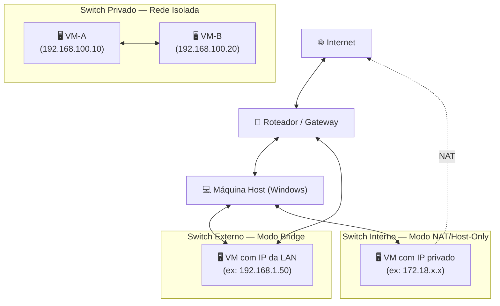

# 🌐 Aula 09: Redes Virtuais — VMs, ISOs e Hyper-V

**Disciplina:** Redes de Computadores I
**Curso:** Inteligência Artificial e Ciência de Dados — Uniube
**Semana:** 9
**Professor:** Romualdo Mathias Filho
**Tipo:** 🔬 Teórica + Prática (Laboratório)
**Tópicos:** Virtualização, Hypervisor, Virtual Switches (Externo/Interno/Privado), NAT, Bridging, ISOs, Segmentação de Rede Virtual.

---

> 💬 *"Redes virtuais não são uma simulação da realidade — elas são a realidade dos datacenters modernos. Toda cloud pública (AWS, Azure, GCP) é construída sobre exatamente os mesmos princípios que você aprenderá hoje."*

---

## 🎯 Objetivo da Aula

Ao final desta aula, os alunos serão capazes de:
- **Compreender** como a virtualização de redes permite criar infraestruturas completas de rede dentro de uma única máquina física.
- **Distinguir** os três modos de rede virtual do Hyper-V (Externo, Interno, Privado) e mapeá-los aos conceitos de **bridge, NAT e rede isolada** já estudados na disciplina.
- **Criar e configurar** uma Máquina Virtual (VM) com Ubuntu Server, conectando-a em rede com o host e com outras VMs.
- **Analisar** como o tráfego de rede se comporta em cada tipo de switch virtual usando ferramentas práticas (`ping`, `ip a`, `netplan`).

---

## 🔄 Revisão Rápida (5 min)

| **Conceito (Aulas Anteriores)** | **Conexão com hoje** |
| --- | --- |
| **Endereçamento IPv4 e Subnetting** | Cada rede virtual do Hyper-V é uma sub-rede. Hoje vamos alocar endereços e configurar máscaras manualmente. |
| **Camada de Rede — Roteamento** | O Default Switch do Hyper-V implementa NAT na camada de rede — o mesmo conceito do seu roteador doméstico. |
| **Camada de Enlace — Switches** | Virtual Switches são abstrações de software dos switches Ethernet físicos que estudamos. As mesmas regras de encaminhamento se aplicam. |
| **Modelo OSI vs. TCP/IP** | Redes virtuais operam em todas as camadas: física (emulada), enlace (Virtual Switch), rede (IP + NAT), transporte (TCP/UDP) e aplicação (SSH, HTTP). |

---

## 📌 1. Por que Virtualizar Redes?

Antes de criar uma rede virtual, precisamos entender **por que ela existe**.

Em um datacenter tradicional, montar um laboratório de redes exige:
- Vários servidores físicos
- Switches e cabos Ethernet reais
- Horas de cabeamento e configuração

Com virtualização, fazemos tudo isso dentro de **uma única máquina**. O resultado é idêntico do ponto de vista da rede — o protocolo TCP/IP não sabe (nem se importa) se está trafegando por um cabo de cobre ou por um barramento de software.

> 💡 **Conexão com o mercado:** AWS EC2, Azure Virtual Machines e Google Cloud Compute Engine são todos baseados em hypervisors que implementam exatamente esses mesmos conceitos. Ao aprender Hyper-V hoje, você está aprendendo a base tecnológica de toda computação em nuvem.

---

## 📌 2. Conceitos de Virtualização de Rede

### 2.1 — Hypervisor: o gerenciador de VMs

O **hypervisor** é o software responsável por criar e gerenciar Máquinas Virtuais (VMs). Existem dois tipos:

| **Tipo** | **Onde roda** | **Exemplos** | **Desempenho** |
| --- | --- | --- | --- |
| **Tipo 1 (Bare-Metal)** | Diretamente sobre o hardware | Hyper-V, VMware ESXi, KVM | ⭐ Alto |
| **Tipo 2 (Hosted)** | Dentro de um SO hospedeiro | VirtualBox, VMware Workstation | Moderado |

> 💡 **Analogia:** O Hyper-V Tipo 1 é o **gerente de condomínio** que controla o prédio inteiro (hardware). O VirtualBox Tipo 2 é um **inquilino** que subaluga um quarto do próprio apartamento — funciona, mas com mais overhead.

O **Microsoft Hyper-V** é um hypervisor Tipo 1 nativo do Windows 10/11 Pro/Enterprise. Uma vez ativado, o próprio Windows passa a rodar como uma VM privilegiada sobre ele.

---

### 2.2 — O que é uma ISO?

Uma **ISO** é um arquivo de imagem de disco — uma cópia byte a byte de um CD/DVD ou mídia de instalação. Para instalar um sistema operacional em uma VM, usamos um arquivo `.iso` no lugar de uma mídia física.

| **Aspecto** | **Mídia Física** | **Arquivo ISO** |
| --- | --- | --- |
| Velocidade de leitura | Limitada pelo hardware óptico | Limitada apenas pela RAM/disco do host |
| Distribuição | Física (correios, loja) | Download direto da internet |
| Reusabilidade | Uma cópia por vez | Infinitas VMs simultâneas |
| Armazenamento | CD/DVD (descartável) | Arquivo no disco |

**Fontes oficiais de ISOs para laboratório:**
- **Ubuntu Server:** [ubuntu.com/download/server](https://ubuntu.com/download/server) → Versão **24.04 LTS**
- **Debian:** [debian.org/distrib](https://www.debian.org/distrib/)
- **Windows Server:** [Microsoft Evaluation Center](https://www.microsoft.com/evalcenter)

---

## 📌 3. Tipos de Switch Virtual no Hyper-V

Esta é a seção mais importante da aula. Os três tipos de Virtual Switch implementam conceitos fundamentais de redes que já estudamos.



### 3.1 — Switch Externo (Bridge Mode)

**Conceito de rede equivalente:** **Bridge** (Ponte)

O switch externo "liga" a VM diretamente à **placa de rede física do Host**, como se a VM tivesse seu próprio cabo de rede conectado ao switch físico da sala.

- A VM recebe um IP **do mesmo roteador da rede física** (via DHCP ou estático)
- Outros computadores da rede conseguem enxergar e acessar a VM
- A VM pode acessar a internet diretamente

> 🔧 **Caso de uso:** Servidor web que precisa ser acessado por todos os PCs do laboratório. Simulação de um servidor em produção na rede local.

```
Roteador (192.168.1.1)
    ├── PC do Aluno A (192.168.1.10)
    ├── PC do Aluno B (192.168.1.11)
    └── VM no Hyper-V (192.168.1.50) ← mesma rede, mesmo switch físico (em modo bridge)
```

---

### 3.2 — Switch Interno (NAT / Host-Only)

**Conceito de rede equivalente:** **NAT** (Network Address Translation) + Host-Only

O switch interno cria uma **rede privada entre o Host e as VMs**. O Host consegue acessar as VMs, mas a rede física externa não. Para ter internet, o Hyper-V usa NAT (o Host "empresta" sua conexão).

- VM e Host se comunicam normalmente
- Rede física (outros PCs) **não vê** as VMs
- Com o **Default Switch**, o NAT é automático e as VMs têm internet

> 🔧 **Caso de uso:** Laboratório de estudo onde você precisa acessar a VM do seu próprio computador sem expô-la para a rede da sala. Desenvolvimento e testes.

---

### 3.3 — Switch Privado (Rede Isolada)

**Conceito de rede equivalente:** **Rede Isolada / Air-gapped network**

O switch privado cria uma rede onde **apenas as VMs conectadas a ele se comunicam**. O Host não tem acesso. Não há internet. É um segmento completamente isolado.

- Sem acesso à internet
- Sem acesso ao Host
- Apenas VMs↔VMs

> 🔧 **Caso de uso:** Simular uma rede de backend isolada (banco de dados, microserviços internos). Implementar segurança por segmentação — exatamente o que empresas fazem com VLANs em redes físicas.

---

### 3.4 — Default Switch (Bônus Hyper-V)

O Windows cria automaticamente o **"Default Switch"** — um switch **Interno com NAT automático configurado**. As VMs conectadas a ele têm acesso à internet (via NAT do host) sem nenhuma configuração adicional. É o modo ideal para laboratório.

**Tabela Comparativa Completa:**

| **Tipo** | **VM → Internet** | **VM → Host** | **VM → VM** | **Rede física → VM** | **Conceito equivalente** |
| --- | --- | --- | --- | --- | --- |
| **Externo** | ✅ Direto | ✅ Sim | ✅ Sim | ✅ Sim | Bridge / Modo promíscuo |
| **Interno** | ❌ (NAT manual) | ✅ Sim | ✅ Sim | ❌ Não | Host-Only + NAT opcional |
| **Default Switch** | ✅ NAT automático | ✅ Sim | ✅ Sim | ❌ Não | NAT automático |
| **Privado** | ❌ Não | ❌ Não | ✅ Sim | ❌ Não | Rede isolada / Air-gap |

---

## 📌 4. Laboratório Prático — Criando e Conectando VMs em Rede

### Pré-requisitos
- Windows 10/11 Pro, Enterprise ou Education (64 bits)
- CPU com suporte a virtualização: **Intel VT-x** ou **AMD-V** (verificar BIOS/UEFI)
- Mínimo **8 GB RAM** (recomendado para rodar host + 2 VMs)
- ISO do Ubuntu Server 24.04 LTS baixada

### Passo 4.1 — Ativando o Hyper-V

**Via PowerShell (como Administrador):**
```powershell
Enable-WindowsOptionalFeature -Online -FeatureName Microsoft-Hyper-V -All
```

Ou via interface: `Painel de Controle → Programas → Ativar recursos do Windows → ✅ Hyper-V`

> ⚠️ **Reinicie** o computador após a ativação.

---

### Passo 4.2 — Criando o Switch Virtual Interno

Antes de criar a VM, vamos preparar a rede:

1. Abra o **Gerenciador do Hyper-V**
2. No painel direito: **Gerenciador de Comutador Virtual**
3. Selecione **Interno** → **Criar Comutador Virtual**
4. Nome: `Rede-Redes-Lab`
5. Clique em **Aplicar** e **OK**

> 💡 Um adaptador virtual (`vEthernet (Rede-Redes-Lab)`) será criado no Host — você pode dar a ele um IP estático para comunicação Host↔VM.

---

### Passo 4.3 — Criando a Máquina Virtual

1. Hyper-V → **Novo → Máquina Virtual**
2. Siga o assistente:

| **Configuração** | **Valor** | **Justificativa** |
| --- | --- | --- |
| Nome | `SRV-UBUNTU-REDES` | Nomenclatura de servidor |
| Geração | **Geração 2** | UEFI, boot moderno |
| RAM | **2048 MB** + Memória Dinâmica | Econômico para lab |
| Rede | **Default Switch** | Internet durante instalação |
| Disco | **20 GB** (novo VHDX) | Suficiente para Ubuntu Server |
| ISO | Apontar para `ubuntu-24.04-live-server-amd64.iso` | — |

---

### Passo 4.4 — Configurando Secure Boot para Linux

> ⚠️ **CRÍTICO — sem isso a VM não inicia!**

1. Clique com o botão direito na VM → **Configurações**
2. **Segurança → Inicialização Segura**
3. Modelo: **`Autoridade de Certificação UEFI da Microsoft`**
4. Clique em **OK**

---

### Passo 4.5 — Instalando o Ubuntu Server

1. Inicie a VM → **Conectar → Iniciar**
2. Siga o instalador:

| **Tela** | **Ação** |
| --- | --- |
| Idioma | **English** (recomendado para servidores) |
| Network | Verifique que `eth0` recebeu IP via DHCP ✅ |
| Storage | Disco inteiro com **LVM** |
| Profile | Username: `aluno` / Server: `srv-redes-01` |
| **SSH** | ✅ **Marque "Install OpenSSH server"** |
| Finalização | **Reboot Now** |

---

### Passo 4.6 — Configurando a Segunda Interface de Rede

Após a instalação, vamos adicionar o switch interno à VM para comunicação Host↔VM:

1. VM → **Configurações → Adicionar Hardware → Adaptador de Rede**
2. Selecione o Switch: `Rede-Redes-Lab`
3. Clique em **OK**

Dentro da VM, configure o IP estático via **Netplan**:

```bash
# Verificar interfaces disponíveis
ip a

# Editar a configuração de rede
sudo nano /etc/netplan/00-installer-config.yaml
```

**Conteúdo do arquivo** (adapte `eth1` ao nome real da sua interface):

```yaml
network:
  version: 2
  ethernets:
    eth0:          # Interface do Default Switch (DHCP/internet)
      dhcp4: true
    eth1:          # Interface do Switch Interno (IP estático)
      dhcp4: false
      addresses:
        - 192.168.100.10/24
```

```bash
# Aplicar as configurações
sudo netplan apply

# Verificar
ip a
```

**No Host (adaptador virtual):** Configure o IP `192.168.100.1/24` no adaptador `vEthernet (Rede-Redes-Lab)`:
- `Win + R` → `ncpa.cpl` → Propriedades → TCP/IPv4 → `192.168.100.1` / `255.255.255.0`

**Teste de conectividade:**
```bash
# Da VM para o Host
ping 192.168.100.1 -c 4

# Do Host (PowerShell) para a VM
ping 192.168.100.10
```

---

### Passo 4.7 — Acesso via SSH

Com a rede funcionando, acesse o servidor como um sysadmin real:

```bash
# No PowerShell ou Terminal do Windows
ssh aluno@192.168.100.10
```

> 🎯 **Parabéns!** Você está administrando um servidor Linux virtualizado via SSH através de uma rede virtual configurada por você — exatamente como é feito em AWS EC2, Azure VMs e datacenters corporativos.

---

## 📋 Resumo Estrutural

| **Conceito** | **Definição em Uma Frase** |
| --- | --- |
| **Hypervisor Tipo 1 (Bare-Metal)** | Roda diretamente sobre o hardware antes do SO; gerencia VMs com alto desempenho (ex: Hyper-V). |
| **Hypervisor Tipo 2 (Hosted)** | Roda dentro de um SO existente, com overhead adicional (ex: VirtualBox). |
| **Arquivo ISO** | Imagem bit a bit de uma mídia de instalação, usada para instalar SOs em VMs sem mídia física. |
| **Switch Virtual Externo** | Liga a VM à placa de rede física do Host — VM recebe IP do roteador real (modo bridge). |
| **Switch Virtual Interno** | Cria rede privada entre VMs e Host; sem exposição à rede física. |
| **Switch Virtual Privado** | Isola VMs entre si; o Host não tem acesso — equivalente a uma VLAN isolada. |
| **Default Switch** | Switch Interno com NAT automático — VMs têm internet via conexão do Host. |
| **Netplan** | Utilitário do Ubuntu para configurar interfaces de rede via arquivos YAML. |
| **NAT (Network Address Translation)** | Técnica que permite múltiplos dispositivos internos compartilharem um único IP externo. |
| **Geração 2 (Hyper-V)** | Formato de VM moderna com suporte a UEFI e Secure Boot — obrigatório para SOs modernos. |

---

%%
## ❓ Banco de Questões

> 🔒 *Seção exclusiva do professor — não publicada para os alunos.*

### Questão 1 (Múltipla Escolha — Nível: Básico)

**Enunciado:** Um aluno criou uma VM no Hyper-V e conectou-a a um **Switch Virtual Privado**. Ele tenta acessar o Google (`ping 8.8.8.8`) e não recebe resposta. Por que isso acontece?

- [ ] A) O Hyper-V bloqueia por padrão requisições ICMP de VMs.
- [ ] B) O Ubuntu Server precisa de configuração adicional de firewall para acessar a internet.
- [x] C) O Switch Privado não fornece acesso à internet nem ao Host — apenas comunicação entre as VMs conectadas a ele. ✅
- [ ] D) A VM precisa de um IP estático para acessar a internet.

**Justificativa:** O Switch Privado cria uma rede completamente isolada. Não há roteamento para a rede física nem para a internet. Para ter internet, deve-se usar o Default Switch ou um Switch Externo.

---

### Questão 2 (Múltipla Escolha — Nível: Intermediário)

**Enunciado:** Em uma empresa, o departamento de TI precisa criar um laboratório virtual com: (1) um servidor web acessível por todos os PCs da rede local, (2) um servidor de banco de dados acessível apenas pelo servidor web. Qual combinação de switches virtuais Hyper-V implementa corretamente essa arquitetura?

- [ ] A) Ambos em Switch Externo.
- [ ] B) Servidor web em Default Switch; banco de dados em Switch Interno.
- [x] C) Servidor web em Switch Externo + Switch Privado; banco de dados apenas em Switch Privado. ✅
- [ ] D) Servidor web em Switch Interno; banco de dados em Switch Privado.

**Justificativa:** O servidor web precisa de dois adaptadores: Switch Externo (para ser acessado pela rede local) e Switch Privado (para comunicar-se com o banco). O banco de dados usa apenas Switch Privado — invisível para a rede física, acessível apenas pelo servidor web que compartilha o mesmo Switch Privado.

---

### Questão 3 (Múltipla Escolha — Nível: Intermediário)

**Enunciado:** Qual é a principal diferença entre o **Default Switch** e um **Switch Interno** criado manualmente no Hyper-V, do ponto de vista de redes?

- [ ] A) O Default Switch permite acesso à rede física; o Switch Interno não.
- [x] B) O Default Switch inclui NAT automático, garantindo que as VMs tenham acesso à internet via conexão do Host sem configuração adicional. ✅
- [ ] C) O Switch Interno tem maior desempenho por usar menos recursos de CPU.
- [ ] D) Não há diferença — ambos são idênticos em funcionalidade.

**Justificativa:** O Default Switch implementa NAT automaticamente, traduzindo o IP da VM para o IP do Host ao sair para a internet. Um Switch Interno manual não tem NAT por padrão — você teria que configurar ICS (Internet Connection Sharing) ou um roteamento manual no Host.

---

### Questão 4 (Dissertativa — Nível: Avançado)

**Enunciado:** Explique o conceito de NAT (Network Address Translation) e demonstre como o **Default Switch** do Hyper-V o implementa. Em seguida, compare esse funcionamento com o NAT do seu roteador doméstico.

**Resposta esperada:**
NAT é a técnica que permite que múltiplos dispositivos de uma rede privada compartilhem um único endereço IP público. O roteador/gateway mantém uma tabela de tradução: quando um pacote sai da rede interna, ele substitui o IP privado (ex: `192.168.1.x`) pelo IP público, registrando a associação. Quando a resposta volta, ele revertem o processo.

O Default Switch do Hyper-V implementa NAT exatamente da mesma forma: a VM tem um IP privado (ex: `172.x.x.x`), e o Hyper-V atua como um roteador NAT no Host, traduzindo para o IP real do Host ao acessar a internet. É funcionalmente idêntico ao roteador doméstico — a diferença é que o "roteador" aqui é um software no Windows, não um hardware dedicado.

---
%%

## 📄 Artigo de Aprofundamento

- [Microsoft Learn — Tipos de Switch Virtual do Hyper-V](https://learn.microsoft.com/pt-br/windows-server/virtualization/hyper-v/get-started/create-a-virtual-switch-for-hyper-v-virtual-machines)
> *Documentação oficial cobrindo todos os tipos de switch, requisitos e boas práticas. Essencial para aprofundamento na configuração avançada.*

- [Ubuntu Server — Netplan Documentation](https://netplan.io/reference)
> *Guia completo de configuração de rede via Netplan no Ubuntu Server — o método padrão para configurar IPs estáticos e múltiplas interfaces.*

---

## 📚 Referências Bibliográficas e Citações

- **TANENBAUM, Andrew S.** *Redes de Computadores*. 5ª ed. Pearson, 2011. **(Cap. 5 — Camada de Rede: NAT, pp. 450–455; Cap. 8 — Segurança de Redes, p. 767)**. Base conceitual para NAT e SSH.
- **TANENBAUM, Andrew S.; WOODHULL, Albert S.** *Sistemas Operacionais: Projeto e Implementação*. 3ª ed. Bookman, 2008. **(Cap. 8 — Virtualização, pp. 487–512)**. Fundamentos de hypervisors Tipo 1 e Tipo 2.
- **STALLINGS, William.** *Arquitetura e Organização de Computadores*. 11ª ed. Pearson, 2024. **(Cap. 3 — Barramentos e Interconexão, p. 68)**. Contexto de hardware para virtualização.
- **Microsoft Learn.** *Hyper-V no Windows Server*. Disponível em: [https://learn.microsoft.com/pt-br/windows-server/virtualization/hyper-v/](https://learn.microsoft.com/pt-br/windows-server/virtualization/hyper-v/). Acesso em: Maio 2026.
- **Canonical Ltd.** *Ubuntu Server 24.04 LTS — Installation Guide*. Disponível em: [https://ubuntu.com/server/docs](https://ubuntu.com/server/docs). Acesso em: Maio 2026.

---
*Última atualização: 2026-05-18 | Status: publicado*
