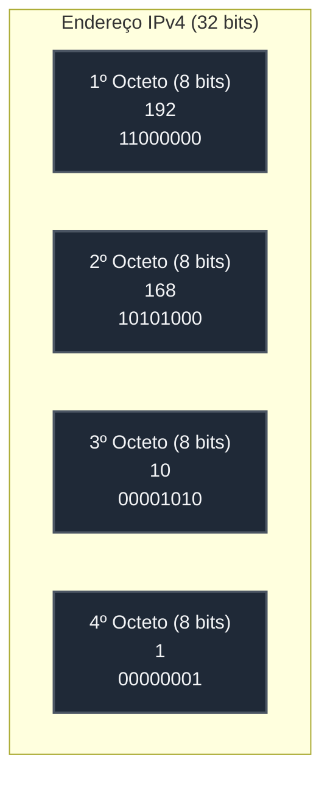
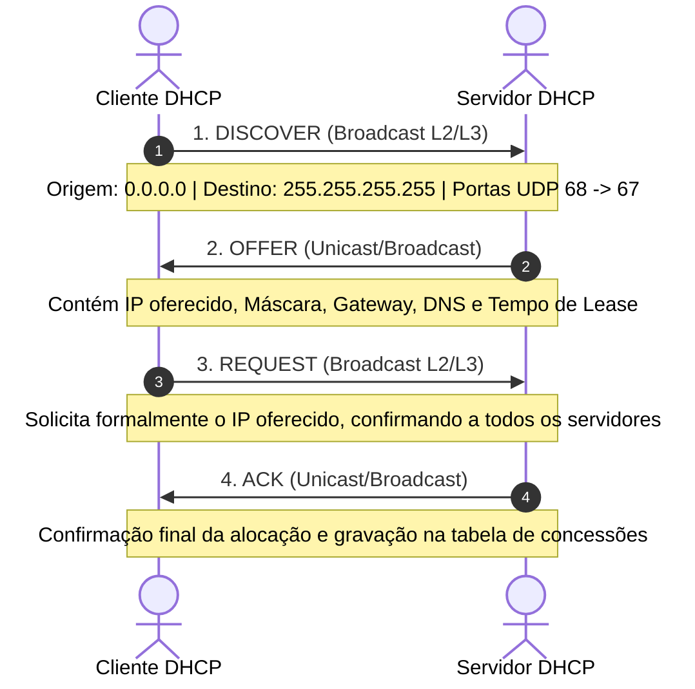

# 🟢 Aula 10 e Aula 11: Endereçamento IP, DHCP e Prática com Wireshark

**Disciplina:** Redes de Computadores I (Cód. RED-01)  
**Curso:** Engenharia / TI — Uniube  
**Semana:** 10  
**Professor:** Romualdo Mathias Filho  
**Tipo:** 🔬 Teórico-Prática (Unificada)  

---

> [!INFO] 🎯 Visão Geral da Aula & Recursos
> Esta aula unificada monumental consolida os pilares práticos e teóricos do endereçamento lógico. Você dominará a matemática do IPv4, a arquitetura moderna de 128 bits do IPv6, a montagem de infraestruturas locais de roteamento no Packet Tracer, o protocolo de alocação de IPs dinâmicos DHCP (DORA) e a auditoria de pacotes de dados reais em nível de bits utilizando o Wireshark.
> 
> **O que você vai dominar:**
> - A estrutura de 32 bits do IPv4, operação binária AND e cálculo de sub-redes CIDR.
> - A estrutura de 128 bits do IPv6, representação hexadecimal e simplificações de escrita.
> - Montagem física e configuração de rotas e gateways de Camada 3 Cisco IOS CLI.
> - O protocolo DHCP e o processo de alocação DORA (*Discover, Offer, Request, Acknowledge*).
> - Roteiro prático de captura, filtragem e inspeção detalhada de cabeçalhos no Wireshark.
> 
> **📂 Recursos para Download e Estudo:**
> - Calculadora de Sub-redes IPv4/IPv6: [https://www.subnet-calculator.com](https://www.subnet-calculator.com/)
> - Wireshark (Capturador de Pacotes): [https://www.wireshark.org/download.html](https://www.wireshark.org/download.html)
> - Laboratório Prático Conectado (Packet Tracer): [[Aula 06 - Pratica Enderecamento IPv4 e Sub-redes Packet Tracer|Aula 06 (Prática Packet Tracer)]]

---

## 🎯 Objetivo da Aula

Ao final desta aula, os alunos serão capazes de:
- **Compreender** e realizar conversões binário-decimal no IPv4 e simplificações de escrita hexadecimal no IPv6.
- **Calcular** planos de endereçamento com máscara CIDR para divisão de sub-redes lógicas.
- **Configurar** fisicamente switches e interfaces de roteadores Cisco via CLI no simulador Cisco Packet Tracer.
- **Explicar** o funcionamento do protocolo DHCP e o processo de alocação dinâmica DORA.
- **Capturar** o tráfego de rede local com o Wireshark, forçando renovações de IPs via terminal.
- **Analisar** frames e pacotes DHCP Discover e Offer no Wireshark, identificando portas UDP 67/68, MACs/IPs de broadcast e cabeçalhos.

---

## 🔄 Revisão Rápida (5 min)

| **Conceito e Link de Origem** | **Conexão com a Aula de Hoje** |
| :--- | :--- |
| **[[Aula 04 - Camada Fisica e Enlace\|Aula 04 (Camada Enlace)]]** | Estudamos switches e a tabela de endereços físicos MAC (48 bits). Hoje, subiremos para a Camada 3 e veremos o endereçamento lógico IP (32 bits e 128 bits). |
| **[[Aula 05 - Modelo OSI vs TCP IP\|Aula 05 (Modelo OSI vs. TCP-IP)]]** | Analisamos a estrutura do cabeçalho IP e a jornada do pacote de dados. Hoje, entraremos a fundo nos campos de IP de origem e destino daquele cabeçalho. |
| **[[Aula 06 - Pratica Enderecamento IPv4 e Sub-redes Packet Tracer\|Aula 06 (Prática Packet Tracer)]]** | Montamos e configuramos fisicamente uma topologia interligada por roteadores Cisco. Hoje, consolidaremos a teoria e a prática desta interconexão de forma monumental. |

---

## 📌 1. A Estrutura do Endereço IPv4, Classes e IPs Reservados [Teoria ⏳ 15 min]

O **Internet Protocol version 4 (IPv4)** é o protocolo padrão da Camada de Rede (Internet) responsável pelo endereçamento lógico e pelo roteamento de pacotes na rede mundial de computadores.

### 1.1 — Representação Binária vs. Decimal Pontuado

Um endereço IPv4 é uma sequência lógica de **32 bits** (sinais binários 0 e 1). Para facilitar a leitura humana, esses 32 bits são divididos em **quatro octetos** (grupos de 8 bits) separados por pontos. Esta notação é chamada de **Decimal Pontuado**.



Cada bit em um octeto possui um peso posicional baseado em potências de 2, variando de $2^7$ (128) a $2^0$ (1). O valor decimal de cada octeto varia de **0 a 255**.

### 1.2 — Divisão Hierárquica: Rede vs. Host

Todo endereço IP é dividido logicamente em duas partes fundamentais:
1. **Parte de Rede (Network ID):** Identifica a rede específica à qual o dispositivo pertence. Todos os dispositivos na mesma sub-rede física devem compartilhar a mesma identificação de rede.
2. **Parte de Host (Host ID):** Identifica de forma única o dispositivo individual (computador, switch, interface do roteador, impressora) dentro daquela rede específica.

### 1.3 — Classes Clássicas e IPs Especiais (RFC 1918)

| Classe | Intervalo do 1º Octeto | Máscara Padrão | Quantidade de Sub-redes | Hosts por Rede | Uso Principal |
| :--- | :--- | :--- | :--- | :--- | :--- |
| **A** | `1.0.0.0` a `126.255.255.255` | `255.0.0.0` (/8) | 128 | ~16,7 Milhões | Organizações e Redes Globais |
| **B** | `128.0.0.0` a `191.255.255.255` | `255.255.0.0` (/16) | 16.384 | 65.534 | Redes Corporativas Médias |
| **C** | `192.0.0.0` a `223.255.255.255` | `255.255.255.0` (/24)| ~2 Milhões | 254 | Redes Domésticas e Pequenas |
| **D** | `224.0.0.0` a `239.255.255.255` | Sem máscara padrão | - | Multicast | Transmissão de Grupo (Streaming/IPTV) |
| **E** | `240.0.0.0` a `255.255.255.255` | Sem máscara padrão | - | Experimental | Reservado para Pesquisas IETF |

*   **Loopback (Localhost) — `127.0.0.1`:** Usado para testes de loop de software local no próprio computador.
*   **IPs Privados (RFC 1918):** De livre uso local, não são roteáveis na Internet pública, usados para estruturar redes locais:
    *   **Classe A Privada:** `10.0.0.0` a `10.255.255.255`
    *   **Classe B Privada:** `172.16.0.0` a `172.31.255.255`
    *   **Classe C Privada:** `192.168.0.0` a `192.168.255.255`

> [!TIP] 💡 Dica de Produção (Pro-Tip)
> Em grandes corporações como a **Nubank** ou na nuvem de produção do **iFood**, os engenheiros estruturam seus data centers e ambientes de Cloud Computing (VPCs na AWS ou GCP) inteiros utilizando a faixa **Classe A Privada (`10.0.0.0/8`)**. Isso fornece milhões de IPs internos livres de conflitos de Internet. O acesso seguro de saída à Internet pública é feito através de **Gateways NAT (Network Address Translation)**, reduzindo custos de IPs públicos estáticos e ocultando a infraestrutura interna contra ataques externos direcionados.

---

## 📌 2. Máscaras de Rede, CIDR e Cálculo de Sub-redes [Teoria ⏳ 15 min]

A máscara de sub-rede é o elemento crucial de 32 bits que **informa aos roteadores e hosts quais bits de um IP pertencem à rede e quais pertencem ao host**.

### 2.1 — A Operação Lógica AND

Dispositivos de rede realizam uma operação binária **AND (E lógico)** entre o endereço IP e a Máscara para extrair o endereço de rede correspondente. No AND, o resultado só é 1 se ambos os bits comparados forem 1:

```text
IP:       192.168.10.74   ->  11000000.10101000.00001010.01001010
Máscara:  255.255.255.0   ->  11111111.11111111.11111111.00000000
-------------------------------------------------------------------
Rede:     192.168.10.0    ->  11000000.10101000.00001010.00000000
```

### 2.2 — Notação CIDR e Fórmulas de Sub-rede

A notação **CIDR (Classless Inter-Domain Routing)** simplifica essa escrita utilizando uma barra (`/`) seguida pelo número de bits consecutivos que estão ativados na máscara (ex: `/24` = `255.255.255.0`, `/26` = `255.255.255.192`).
Para projetar e calcular sub-redes, utilizamos duas fórmulas fundamentais:
1.  **Quantidade Total de Hosts por Sub-rede:** $Hosts = 2^h - 2$ *(Onde $h$ é o número de bits de host no octeto final).*
2.  **Quantidade de Sub-redes Possíveis:** $Subredes = 2^s$ *(Onde $s$ representa o número de bits "emprestados" da máscara de rede padrão).*

> [!WARNING] ⚠️ Gotcha de Infraestrutura
> O erro mais comum de analistas juniores de infraestrutura é tentar interligar duas filiais de uma empresa cujas sub-redes locais usam o exato mesmo intervalo de IP Privado (ex: ambas usam `192.168.1.0/24`). Isso gera uma **colisão de rotas (overlap)**, impossibilitando que os roteadores saibam para qual ponta enviar os pacotes, pois as duas redes são logicamente idênticas.

---

## 📌 3. Laboratório Prático: Topologia Física e Endereçamento Estático [Hands-On ⏳ 30 min]

Nesta seção prática, utilizaremos o software Cisco Packet Tracer para projetar uma topologia física local e configurar o endereçamento estático nas estações.

### 3.1 — Exercício 1: Montagem da Topologia Física

Construiremos a infraestrutura básica composta por dois segmentos físicos distintos que serão interligados fisicamente por um roteador central:

```
  [PC0] ---+                             +--- [PC2]
  [PC1] ---+--- [Switch0] --- [R0] ------+--- [PC3]
                          (Roteador)

  Rede A: 192.168.10.0/24         Rede B: 192.168.20.0/24
```

1. Abra o Cisco Packet Tracer.
2. Adicione os seguintes equipamentos no workspace:
   - **2x Switches** do modelo Cisco Catalyst **2960**.
   - **1x Roteador** do modelo Cisco **2911** (ou ISR4331).
   - **4x PCs** genéricos.
3. Realize a interconexão utilizando **cabos de cobre direto (Straight-Through)**:
   - `PC0 (Fa0)` para `Switch0 (Fa0/1)`
   - `PC1 (Fa0)` para `Switch0 (Fa0/2)`
   - `PC2 (Fa0)` para `Switch1 (Fa0/1)`
   - `PC3 (Fa0)` para `Switch1 (Fa0/2)`
   - `Switch0 (Gig0/1)` para o roteador `R0 (Gig0/0)`
   - `Switch1 (Gig0/1)` para o roteador `R0 (Gig0/1)`
4. Salve o arquivo com o nome `Aula10_Laboratorio.pkt`.

### 3.2 — Exercício 2: Endereçamento Estático da Rede A

Configuraremos as estações pertencentes ao segmento **Rede A** utilizando endereços privados estáticos Classe C:

| **Dispositivo** | **Endereço IP** | **Máscara de Sub-rede** | **Gateway Padrão** |
| :--- | :--- | :--- | :--- |
| **PC0** | `192.168.10.10` | `255.255.255.0` | `192.168.10.1` |
| **PC1** | `192.168.10.11` | `255.255.255.0` | `192.168.10.1` |

1. Clique no **PC0** -> aba **Desktop** -> menu **IP Configuration**.
2. Marque a opção **Static** e insira os dados de IP, máscara e gateway descritos na tabela acima.
3. Repita o procedimento no **PC1**.
4. Abra o Command Prompt do PC0 e teste a conectividade com seu vizinho executando: `ping 192.168.10.11`. O ping deve ter sucesso completo.

### 3.3 — Exercício 3: Endereçamento Estático da Rede B

Configuraremos as estações do segmento **Rede B**:

| **Dispositivo** | **Endereço IP** | **Máscara de Sub-rede** | **Gateway Padrão** |
| :--- | :--- | :--- | :--- |
| **PC2** | `192.168.20.10` | `255.255.255.0` | `192.168.20.1` |
| **PC3** | `192.168.20.11` | `255.255.255.0` | `192.168.20.1` |

1. Aplique os dados da tabela acima nas estações **PC2** e **PC3**.
2. Valide o tráfego local entre eles executando ping do PC2 para o PC3 (`ping 192.168.20.11`).
3. Tente pingar do PC2 para o PC0 (`ping 192.168.10.10`).
   *Observe que o ping falhará ("Request timed out"), pois as interfaces do roteador que servem de gateway ainda não estão configuradas e ativas.*

---

## 📌 4. Introdução ao IPv6: Estrutura, Representação e Simplificação [Teoria ⏳ 15 min]

Com a explosão de dispositivos conectados à Internet (smartphones, IoT, servidores em nuvem), o espaço de endereçamento de **32 bits do IPv4** esgotou-se oficialmente. Para resolver este problema crônico, a IETF projetou o **Internet Protocol version 6 (IPv6)**.

### 4.1 — Estrutura Física de 128 Bits

O IPv6 utiliza endereços lógicos de **128 bits** de comprimento. Isso amplia o espaço de endereçamento para um número astronômico:
- $2^{128} \approx 3,4 \times 10^{38}$ endereços únicos (aproximadamente **340 undecilhões** de endereços).
- Na prática, isso fornece cerca de 50 octilhões de endereços para cada habitante do planeta, permitindo que cada dispositivo possua um IP público roteável global exclusivo, eliminando a dependência do NAT.

### 4.2 — Representação Hexadecimal e Hextetos

Para simplificar a escrita de uma cadeia binária tão longa, o IPv6 é escrito em **Hexadecimal** (base 16: números de `0` a `9` e letras de `a` a `f`).
Os 128 bits são agrupados em **8 blocos de 16 bits** (chamados de **hextetos**), separados por dois-pontos (`:`).
- *Exemplo de endereço IPv6 completo:*
  `2001:0db8:85a3:0000:0000:8a2e:0370:7334`

### 4.3 — Regras Oficiais de Simplificação IETF (RFC 5952)

Escrever ou digitar 32 caracteres hexadecimais é propenso a erros. Por isso, a IETF estabeleceu duas regras de simplificação:

1.  **Regra 1: Omissão de Zeros à Esquerda:** Em qualquer hexteto, os zeros que iniciam o grupo à esquerda podem ser omitidos. Zeros à direita não podem ser removidos.
    *   *Exemplo:* `0db8` $\rightarrow$ `db8` | `0000` $\rightarrow$ `0` | `0bff` $\rightarrow$ `bff`
2.  **Regra 2: Compressão de Zeros Duplos (`::`):** Sequências consecutivas de hextetos compostos apenas por zeros podem ser totalmente substituídas por dois-pontos duplos (`::`).
    *   *Gotcha Importante:* Esta regra **SÓ pode ser aplicada UMA ÚNICA VEZ** no endereço inteiro. Se aplicada mais de uma vez, seria impossível para a pilha de rede saber exatamente quantos zeros pertencem a cada lado.
    *   *Caso existam sequências de tamanhos diferentes:* Comprime-se a maior sequência de zeros. Se tiverem o mesmo tamanho, comprime-se a sequência mais à esquerda.

#### 📈 Demonstração Passo a Passo de Simplificação:
- **Endereço Completo:** `2001:0db8:0000:0000:0000:0000:1428:57ab`
- **Passo 1 (Omitir zeros à esquerda):** `2001:db8:0:0:0:0:1428:57ab`
- **Passo 2 (Comprimir zeros consecutivos):** `2001:db8::1428:57ab` (Representação simplificada padrão).

---

### 🧠 Checkpoint: Teste seu Conhecimento (IPv6)!

<details>
<summary><b>🔍 Exercício Rápido: Aplique as regras de simplificação oficiais da IETF (RFC 5952) para obter a representação mais curta possível do endereço IPv6 a seguir: 2001:0000:0000:00ab:0000:0000:0000:01ff</b></summary>
<blockquote>

**Resposta Correta:** `2001:0:0:ab::1ff`
- **Passo 1 (Remover zeros à esquerda):** `2001:0:0:ab:0:0:0:1ff`
- **Passo 2 (Compressão dos zeros consecutivos):** Temos uma sequência de dois hextetos zerados no início (`:0:0:`) e outra sequência de três hextetos zerados no final (`:0:0:0:`). Para obter a representação mais curta possível, a IETF exige que a maior sequência seja comprimida. Portanto, comprimimos a sequência de três zeros da direita:
  `2001:0:0:ab::1ff`

*(Nota: se as duas sequências fossem de mesmo tamanho, comprimiríamos a mais à esquerda, mas aqui a da direita é mais longa).*

</blockquote>
</details>

---

## 📌 5. O Protocolo DHCP e o Processo de Alocação DORA [Teoria ⏳ 15 min]

O **Dynamic Host Configuration Protocol (DHCP)** é o protocolo da camada de aplicação responsável por automatizar a alocação de endereços IPs, máscaras, gateways e servidores DNS para estações de trabalho de forma dinâmica e centralizada.

### 5.1 — O Processo DORA (Bit a Bit)

O ciclo de concessão de um endereço IP pelo DHCP baseia-se em quatro mensagens de controle fundamentais trocadas sequencialmente, conhecidas como o acrônimo **DORA**:



1.  **D — Discover (Descoberta):** O cliente inicializa sem IP (`0.0.0.0`) e envia um pacote de broadcast para localizar servidores DHCP ativos. 
    - *L2 Destination:* `ff:ff:ff:ff:ff:ff` (Broadcast Físico)
    - *L3 Destination:* `255.255.255.255` (Broadcast Lógico)
    - *Portas UDP:* Origem `68` $\rightarrow$ Destino `67`
2.  **O — Offer (Oferta):** Os servidores DHCP ativos que recebem o Discover respondem oferecendo uma configuração IP disponível, gateway padrão, servidores DNS e tempo de concessão (*lease*).
3.  **R — Request (Solicitação):** O cliente aceita a oferta enviando um broadcast de solicitação formal. Este pacote é enviado em broadcast para que todos os outros servidores DHCP saibam que a oferta daquele IP específico foi aceita, permitindo que liberem suas respectivas ofertas pendentes de volta ao pool.
4.  **A — Ack (Confirmação):** O servidor DHCP selecionado responde com o pacote Acknowledge, confirmando a alocação, gravando a relação de IP/MAC do cliente em sua tabela interna de leases e disparando o timer de locação.

---

## 📌 6. Configuração de DHCP Dinâmico em Roteadores Cisco CLI [Hands-On ⏳ 20 min]

Nesta etapa, ativaremos as portas do roteador `R0` como gateway das sub-redes e configuraremos os escopos de distribuição de IP dinâmico diretamente pela interface de linha de comando (CLI) do Cisco IOS.

### 6.1 — Exercício 4: Ativação das Interfaces do Roteador (CLI)

1. Clique no roteador **R0** -> selecione a aba **CLI**.
2. Configure os IPs de gateway nas interfaces GigabitEthernet do roteador:
```ios
Router> enable
Router# configure terminal
Router(config)# interface GigabitEthernet0/0
Router(config-if)# ip address 192.168.10.1 255.255.255.0
Router(config-if)# no shutdown
Router(config-if)# exit

Router(config)# interface GigabitEthernet0/1
Router(config-if)# ip address 192.168.20.1 255.255.255.0
Router(config-if)# no shutdown
Router(config-if)# exit
Router(config)# exit
Router# show ip interface brief
```
*Verifique se o status físico e lógico de ambas interfaces consta como "up".*

### 6.2 — Exercício 5: Roteamento Fim a Fim e Rastreamento de Saltos

1. Acesse o terminal do **PC0**.
2. Execute o comando para testar a comunicação com a rede remota: `ping 192.168.20.10`.
3. Execute o rastreamento do caminho percorrido pelo pacote: `tracert 192.168.20.10`
   *Observe os dois saltos descritos: o gateway local (interface do roteador `192.168.10.1`) e o host de destino final.*

### 6.3 — Exercício 6: Configuração de DHCP Dinâmico no Cisco IOS

Configuraremos o roteador `R0` como servidor DHCP para alocação automática de endereços na Rede B.

1. Acesse o roteador **R0** -> aba **CLI**.
2. Entre em modo de configuração global e monte as regras de escopo DHCP:
```ios
Router# configure terminal
Router(config)# ip dhcp excluded-address 192.168.20.1 192.168.20.9
Router(config)# ip dhcp pool REDE-B
Router(dhcp-config)# network 192.168.20.0 255.255.255.0
Router(dhcp-config)# default-router 192.168.20.1
Router(dhcp-config)# dns-server 8.8.8.8
Router(dhcp-config)# exit
```
*Nota didática: O comando `ip dhcp excluded-address` é extremamente crítico para impedir que o DHCP distribua IPs que já foram fixados em elementos cruciais (como gateways, switches de gerência ou servidores locais).*

3. Acesse a configuração de IP do **PC2** e do **PC3** no Packet Tracer e altere a opção de **Static** para **DHCP**.
4. Valide a alocação dinâmica. A tela deve exibir a mensagem *"DHCP request successful"* e os campos de IP, máscara e gateway serão preenchidos automaticamente.

---

## 📌 7. Laboratório Prático: Captura e Análise de DHCP no Wireshark [Hands-On ⏳ 20 min]

Neste laboratório prático real, utilizaremos a ferramenta **Wireshark** instalada no seu computador para capturar e auditar as estruturas internas e cabeçalhos das mensagens do protocolo DHCP trocadas pela sua interface de rede física.

### 7.1 — Roteiro de Execução de Captura de Tráfego

1. Abra o **Wireshark**.
2. Dê um duplo clique sobre a sua interface de rede ativa (ex: **Wi-Fi** ou **Ethernet**) para iniciar a captura de pacotes em tempo real.
3. No campo de filtros de visualização no topo da janela, digite **`bootp`** (protocolo base do DHCP) ou **`dhcp`** e pressione **Enter**. A tela ficará inicialmente vazia, aguardando tráfego do protocolo.
4. Para forçar a geração de tráfego DHCP pelo seu sistema operacional, abra o **Prompt de Comando (CMD) como Administrador** ou o Terminal (Linux/macOS) e execute.

**No Windows:**

```cmd
ipconfig /release
ipconfig /renew
```

**No Linux/macOS:**

```bash
sudo dhclient -r
sudo dhclient
```

5. Observe que a captura do Wireshark começará a exibir a sequência de pacotes DORA. Assim que a rede restabelecer a conexão, clique no botão vermelho **Stop (Parar)** no canto superior esquerdo do Wireshark para paralisar a captura.

### 7.2 — Roteiro de Análise de Pacotes e Cabeçalhos

Abaixo está o roteiro de auditoria das estruturas de dados capturadas:

```
+-------------------------------------------------------------+
| WIRESHARK - DETALHES DE PACOTE (EXEMPLO DISCOVER)           |
+-------------------------------------------------------------+
| [+] Frame 1: 342 bytes on wire                              |
| [+] Ethernet II, Src: 3c:7c:3f:1a:2b:3c, Dst: ff:ff:ff:ff:f | <- Broadcast L2
| [+] Internet Protocol Version 4, Src: 0.0.0.0, Dst: 255.255 | <- Broadcast L3
| [+] User Datagram Protocol, Src Port: 68, Dst Port: 67      | <- Portas DHCP
| [-] Bootstrap Protocol (DHCP)                               |
|   |-- Message type: Boot Request (1)                        |
|   |-- Client MAC address: 3c:7c:3f:1a:2b:3c                 |
|   [-] Option: (53) DHCP Message Type (Discover)             | <- Option 53
+-------------------------------------------------------------+
```

1. **Auditoria do Pacote DHCP Discover (1º Pacote):**
   - Selecione a primeira mensagem da captura (**DHCP Discover**).
   - Abra a seção **Ethernet II** (Camada 2): Identifique o endereço de destino (Destination) constando como **`ff:ff:ff:ff:ff:ff`** (Broadcast físico total).
   - Abra a seção **Internet Protocol Version 4** (Camada 3): Identifique que a origem (Source) consta como **`0.0.0.0`** (por não possuir IP válido no boot) e o destino (Destination) consta como **`255.255.255.255`** (Broadcast lógico total).
   - Abra a seção **User Datagram Protocol** (Camada 4): Verifique a porta de origem (Source Port) como **`68`** e a porta de destino (Destination Port) como **`67`**.
   - Abra a seção **Bootstrap Protocol (DHCP)**: Localize a opção **`Option: (53) DHCP Message Type`** e verifique que seu tipo interno está classificado como **`Discover (1)`**.

2. **Auditoria do Pacote DHCP Offer (2º Pacote):**
   - Selecione a segunda mensagem da captura (**DHCP Offer**).
   - Na seção IP, note que o remetente (Source) agora é o IP físico do seu Servidor DHCP/Gateway (ex: `192.168.1.1` ou `192.168.20.1`) e a porta de origem UDP é a **`67`** (com destino na **`68`**).
   - Na seção **Bootstrap Protocol**, expanda as informações e localize o campo **`Your (client) IP address`** (identificado em algumas versões como `yiaddr`). Este é o endereço IP oficial que o servidor está reservando e oferecendo à sua máquina.

---

## 📋 Resumo Estrutural

| **Conceito/Notação/Comando** | **Definição em Uma Frase** |
| :--- | :--- |
| **Endereço IPv4** | Identificador lógico de 32 bits da camada de rede estruturado em quatro octetos. |
| **Máscara de Rede** | Estrutura de 32 bits que separa a porção de rede da porção de host através de uma operação lógica AND binária. |
| **Notação CIDR** | Notação de prefixo que simplifica a escrita de máscaras pelo número de bits consecutivos ativos (ex: `/24` = `255.255.255.0`). |
| **IPv6** | Protocolo de nova geração com endereçamento de 128 bits em hexadecimal estruturado em hextetos. |
| **DHCP** | Protocolo PaaS da camada de aplicação encarregado de alocar IPs de forma automatizada e dinâmica na rede. |
| **Processo DORA** | Sequência lógica de 4 mensagens de controle do DHCP (*Discover, Offer, Request, ACK*). |
| **ip dhcp pool** | Comando de CLI Cisco IOS privilegiado que inicializa a configuração de um escopo de distribuição de IPs. |
| **ipconfig /renew** | Comando executado no prompt Windows para forçar o envio de um DHCP Request visando adquirir IP dinâmico. |
| **Filter `bootp`** | Filtro de exibição nativo do Wireshark utilizado para isolar tráfego de controle e dados do protocolo DHCP. |

---

%%
## ❓ Banco de Questões

> 🔒 *Seção exclusiva do professor — não publicada para os alunos no Quartz.*

### Questão 1 (Múltipla Escolha — Nível: Intermediário)

**Enunciado:** Uma equipe de engenharia do **Nubank** está configurando um novo cluster de microsserviços na nuvem corporativa (AWS VPC). Eles criaram uma sub-rede privada utilizando a faixa de IP `10.50.20.0` com a máscara CIDR `/23`. Para configurar as interfaces de rede dos servidores virtuais, o arquiteto precisa saber: qual o endereço de rede, qual o endereço de broadcast e quantos IPs utilizáveis (hosts) estão disponíveis para atribuição nessa sub-rede?

- [ ] A) Rede: `10.50.20.0`; Broadcast: `10.50.20.255`; Hosts: 254 utilizáveis.
- [ ] B) Rede: `10.50.20.0`; Broadcast: `10.50.21.255`; Hosts: 512 utilizáveis.
- [x] C) Rede: `10.50.20.0`; Broadcast: `10.50.21.255`; Hosts: 510 utilizáveis. ✅
- [ ] D) Rede: `10.50.0.0`; Broadcast: `10.50.255.255`; Hosts: 65.534 utilizáveis.

**Justificativa:** A máscara `/23` possui 23 bits de rede e 9 bits de host ($32 - 23 = 9$). O número total de hosts é dado por $2^9 - 2 = 512 - 2 = 510$ hosts utilizáveis. Como `/23` representa uma máscara `255.255.254.0` na classe B/A, as redes saltam de 2 em 2 no terceiro octeto. A rede em questão inicia em `10.50.20.0` e termina em `10.50.21.255`. O endereço de rede é `10.50.20.0` e o de broadcast é o último IP do bloco (`10.50.21.255`).

---

### Questão 2 (Múltipla Escolha — Nível: Intermediário)

**Enunciado:** Durante o processo de auditoria de segurança da infraestrutura de TI do portal **Mercado Livre**, constatou-se que um comutador virtual de distribuição automática (DHCP) configurado no roteador Cisco de gateway local (`192.168.20.1`) estava alocando IPs sem especificar a diretiva `default-router`. O que acontecerá com o tráfego dos computadores que adquirem IP dinamicamente através deste servidor DHCP?

- [ ] A) Os computadores não conseguirão receber IP e ficarão bloqueados em modo estático temporário.
- [ ] B) Os computadores obterão IPs válidos e conseguirão navegar em sites externos, mas não conseguirão pingar vizinhos locais.
- [x] C) Os computadores receberão IP e máscara válidos e se comunicarão normalmente na mesma rede local física, mas falharão ao tentar enviar pacotes para fora da sub-rede local (como acessar outras redes locais distantes ou a Internet). ✅
- [ ] D) O roteador gerará um loop lógico de broadcast, travando as interfaces do switch associado.

**Justificativa:** A ausência do comando `default-router` nas configurações do pool DHCP faz com que as estações recebam IP e máscara de sub-rede, mas permaneçam com o campo "Default Gateway" em branco (zerado). Sem gateway padrão configurado, os hosts sabem resolver IPs locais via ARP de Camada 2, mas o sistema operacional descarta imediatamente qualquer pacote cujo IP de destino pertença a outra rede lógica, por não possuir a interface do roteador mapeada como gateway de saída.

---

### Questão 3 (Múltipla Escolha — Nível: Avançado / CCNA-Style)

**Enunciado:** Para interligar as VPCs locais aos servidores na AWS, um arquiteto SRE precisa simplificar a representação do endereço IPv6 corporativo do banco de dados local a fim de configurá-lo no arquivo de rotas. O endereço de origem completo mapeado é `2001:0db8:0000:0000:00fa:0000:0000:0001`. De acordo com as diretrizes e regras oficiais da IETF (RFC 5952), qual alternativa apresenta a representação simplificada correta do IP em produção?

- [x] A) `2001:db8::fa:0:0:1` ✅
- [ ] B) `2001:db8:0:0:fa::1`
- [ ] C) `2001:db8::fa::1`
- [ ] D) `2001:db8:0:0:fa:0:0:1`

**Justificativa:** 
1. Omitindo os zeros à esquerda em cada hexteto, obtemos: `2001:db8:0:0:fa:0:0:1`.
2. Temos duas sequências idênticas de dois hextetos zerados: `:0:0:` no início e `:0:0:` no final.
3. De acordo com as regras oficiais de padronização da IETF (RFC 5952, Seção 4.2.3), quando houver um empate no tamanho das sequências de hextetos zerados, **deve-se comprimir a primeira sequência (a mais à esquerda)** com o operador duplo `::`.
4. Portanto, a forma padrão simplificada única e correta é: **`2001:db8::fa:0:0:1`**. A alternativa C é inválida pois utiliza `::` duas vezes, gerando ambiguidade técnica de representação lógica.

---

### Questão 4 (Dissertativa — Nível: Avançado)

**Enunciado:** Ao cruzar um roteador corporativo (gateway de Camada 3) em direção a servidores externos de produção do **iFood** na nuvem da AWS, os cabeçalhos das Unidades de Dados de Protocolo (PDUs) de um pacote IP sofrem alterações fundamentais para viabilizar o tráfego ao longo de saltos físicos distintos. Explique detalhadamente o que acontece com os campos de endereçamento de origem e destino contidos no **Cabeçalho IP (Camada 3)** e no **Cabeçalho Ethernet (Camada 2)** no momento em que um frame de dados originado no PC0 atravessa a interface física do roteador em direção a um servidor web remoto.

**Resposta esperada:**
- **Cabeçalho IP (Camada 3) — Endereços IP de Origem e Destino:** Os endereços IP de origem e destino final permanecem estáticos (inalterados) durante toda a viagem lógica fim a fim (salvo aplicação de NAT), pois servem para identificar logicamente o remetente original e o destinatário final do tráfego de forma unívoca na rede mundial.
- **Cabeçalho Ethernet (Camada 2) — Endereços MAC de Origem e Destino:** Os endereços MAC de origem e destino são reescritos e substituídos pelo roteador a cada novo salto físico (salto a salto). Na rede local de origem, o frame gerado possui o MAC de origem do PC0 e o MAC de destino da interface física do roteador local (gateway). Ao receber o frame, o roteador abre o quadro (desencapsulamento), analisa o cabeçalho IP e decide a interface de saída correspondente. Ele então gera um cabeçalho de Camada 2 inteiramente novo, configurando seu próprio MAC de saída como origem física, e o MAC do próximo roteador/dispositivo no caminho (próximo salto) como destino físico, repetindo esse processo em cada roteador da rota física até que o quadro atinja o destino final.

---
%%

---

## 📄 Artigo de Aprofundamento

- [IPv6 Transition Technologies — Cisco Systems](https://www.cisco.com/c/en/us/support/docs/ip/ipv6/115984-ipv6-transition-tech-00.html)
> *Resumo prático: Artigo oficial da Cisco descrevendo os mecanismos de transição lógica entre infraestruturas legadas IPv4 e redes IPv6 modernas (dual-stack, tunelamento e tradução).*

---

## 📚 Referências Bibliográficas

- **TANENBAUM, Andrew S.; FEAMSTER, Nicholas; WETHERALL, David J.** *Redes de Computadores*. 6. ed. São Paulo: Pearson, 2021. **(Capítulo 5: A Camada de Rede — pp. 310–355)**.
- **KUROSE, James F.; ROSS, Keith W.** *Redes de computadores e a internet: uma abordagem top-down*. 8. ed. São Paulo: Pearson Education do Brasil, 2021. **(Capítulo 4: A Camada de Rede: Plano de Dados — pp. 220–260)**.
- **CISCO NETWORKING ACADEMY.** *Curso CCNA v7: Introdução às Redes (ITN)*. Cisco Press, 2020. **(Módulo 11: Endereçamento IPv4; Módulo 12: Endereçamento IPv6)**.

---
*Última atualização: 2026-06-01 | Status: publicado*
