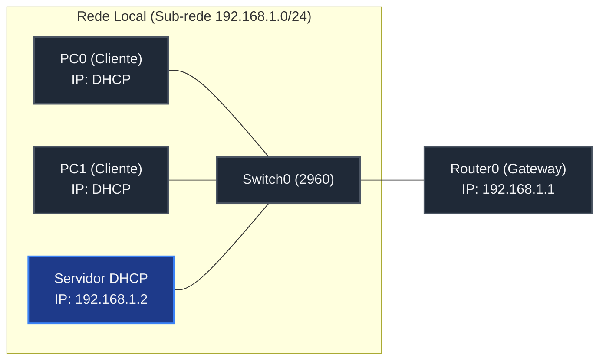
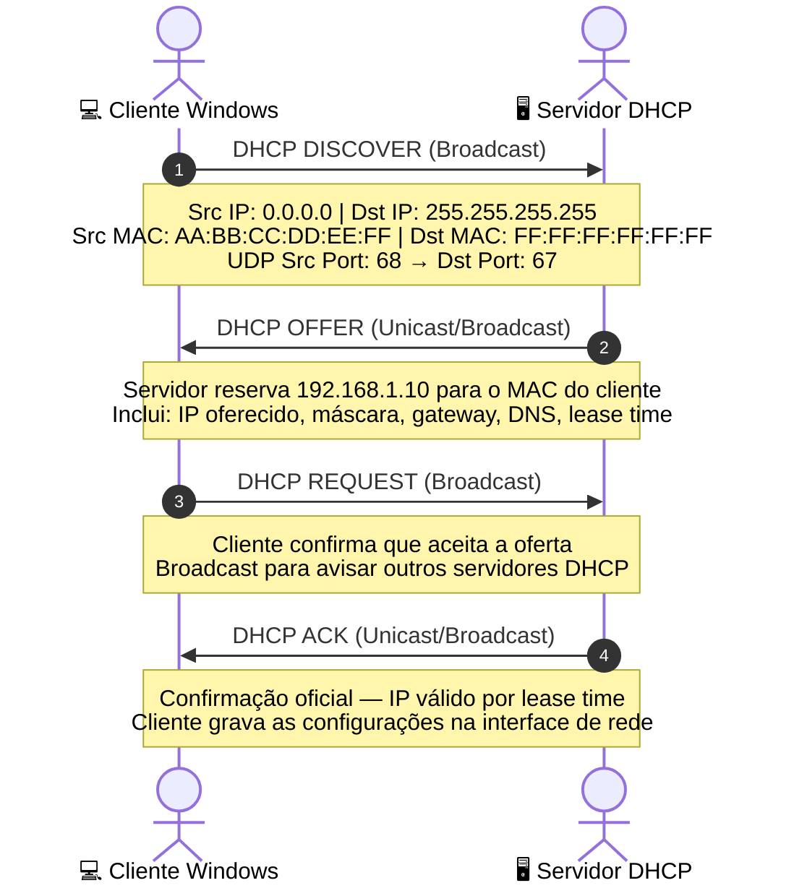

# 🟢 Aula 12: Servidor DHCP Dedicado no Packet Tracer e Ubuntu Server
> [!WARNING] ⚠️ Material de referência — não é a aula desta semana
> Esta página vem de uma oferta anterior da disciplina e continua no ar porque o conteúdo serve para estudo. **A numeração dela não corresponde à semana do calendário de 2026-2** — o calendário que vale é o do [Plano de Ensino e Contrato](./Plano-de-Ensino-e-Contrato). Se ela pedir uma ferramenta antes da semana em que o plano a introduz, siga o plano.

**Disciplina:** Redes de Computadores I (Cód. 49304)  
**Curso:** Sistemas de Informação — Uniube  
**Semana:** 12 | 08/06/2026  
**Professor:** Romualdo Mathias Filho  
**Tipo:** 🔬 Teórico-Prática (Unificada)  
**Tópicos:** Simulação DHCP no Packet Tracer, Implantação no Ubuntu Server, Instalação e Análise com Wireshark.

---

> [!INFO] 🎯 Visão Geral da Aula & Recursos
> **Aprenda como o DHCP funciona por dentro e coloque um servidor real para funcionar — do simulador até o Ubuntu Server — monitorando cada mensagem com o Wireshark no Windows.** Nesta aula você entenderá a teoria completa do protocolo DHCP (campos dos pacotes, lease time, renovação), configurará um servidor dedicado no Packet Tracer, instalará o `isc-dhcp-server` no Ubuntu Server 22.04 LTS e auditará cada etapa do ciclo DORA usando o Wireshark diretamente no Windows.
> 
> * **O que você vai dominar:**
>   - Explicar o funcionamento interno do DHCP: campos Bootstrap, opções DHCP, lease time e renovação de lease.
>   - Simular um servidor DHCP dedicado (Server-PT) no Cisco Packet Tracer.
>   - Instalar e configurar o daemon `isc-dhcp-server` no Ubuntu Server 22.04 LTS.
>   - Monitorar e interpretar o ciclo DORA em tempo real no Wireshark no Windows.
> * **Pré-requisitos:** [[Aula 10 e Aula 11 - Enderecamento IP DHCP e Pratica Wireshark|Aula 10/11 (Conceitos DHCP e DORA)]].
> * **📂 Recursos Adicionais para Download:**
>   - Cenário Packet Tracer com Servidor Dedicado (.pkt): [https://github.com/rofilho/redes1/labs/aula12_dhcp_server.pkt](https://github.com/rofilho/redes1/labs/aula12_dhcp_server.pkt)

---

## 🎯 Objetivo da Aula

Ao final desta aula, os alunos serão capazes de:
- **Explicar** o funcionamento interno do protocolo DHCP, incluindo os campos do pacote Bootstrap, as opções DHCP, o lease time e o mecanismo de renovação.
- **Configurar** o serviço DHCP em um servidor dedicado no Cisco Packet Tracer para alocação automática de IPs.
- **Instalar** e gerenciar o daemon `isc-dhcp-server` no Ubuntu Server 22.04 LTS para distribuição de escopos dinâmicos.
- **Monitorar** e interpretar o ciclo DORA completo no Wireshark instalado em um cliente Windows, identificando cada campo relevante dos pacotes.

---

## 🔄 Revisão Rápida (5 min)

| **Conceito (Aulas Anteriores)** | **Conexão com a Aula de Hoje** |
| :--- | :--- |
| **[[Aula 10 e Aula 11 - Enderecamento IP DHCP e Pratica Wireshark\|Aula 10 e 11 (DHCP e Wireshark)]]** | Estudamos o ciclo DHCP DORA (*Discover, Offer, Request, ACK*) e capturamos pacotes via cliente local. Hoje, assumiremos o papel do administrador, configurando servidores de distribuição. |
| **[[Aula 09 - Redes Virtuais VMs ISOs e Hyper-V\|Aula 09 (Redes Virtuais e VMs)]]** | Aprendemos a criar e configurar VMs e comutadores virtuais. Usaremos esse conhecimento para criar a rede interna isolada para testes do nosso servidor Ubuntu. |
| **[[Aula 06 - Pratica Enderecamento IPv4 e Sub-redes Packet Tracer\|Aula 06 (Prática Packet Tracer)]]** | Mapeamos planos de endereçamento em topologias locais. Hoje, automatizaremos a distribuição destes blocos via DHCP Server dedicado. |

---

## 📌 1. Simulação de Servidor DHCP Dedicado no Packet Tracer [Hands-On ⏳ 20 min]

Em redes corporativas de médio e grande porte, a função de servidor DHCP é frequentemente delegada a **servidores dedicados** (como servidores Windows Server ou Linux dedicados) em vez de ser processada diretamente na CPU dos roteadores de borda. Isso centraliza a gerência e libera recursos de hardware do roteador.

No Cisco Packet Tracer, simulamos este cenário utilizando o dispositivo **Server-PT**.



### 🔧 Roteiro de Configuração Passo a Passo:

1. **Abra o Packet Tracer** e monte a seguinte topologia física:
   - **1x Router (modelo 2911)**
   - **1x Switch (modelo 2960)**
   - **1x Servidor (Server-PT)**
   - **2x PCs Clientes**
   - Interligue todos os dispositivos ao Switch usando cabos de cobre direto (Straight-Through).
2. **Configuração do Gateway (Router0):**
   - Acesse a CLI do roteador e ative a interface GigabitEthernet0/0 com o IP do gateway padrão:
```ios
Router> enable
Router# configure terminal
Router(config)# interface GigabitEthernet0/0
Router(config-if)# ip address 192.168.1.1 255.255.255.0
Router(config-if)# no shutdown
Router(config-if)# exit
```
3. **Configuração IP Estático no Servidor DHCP:**
   - Clique no Servidor $\rightarrow$ aba **Desktop** $\rightarrow$ **IP Configuration**.
   - Defina as seguintes configurações estáticas (o próprio servidor DHCP precisa ter IP fixo):
     - **IP Address:** `192.168.1.2`
     - **Subnet Mask:** `255.255.255.0`
     - **Default Gateway:** `192.168.1.1`
4. **Configuração do Serviço DHCP no Servidor:**
   - Acesse a aba **Services** (Serviços) do Servidor $\rightarrow$ selecione **DHCP** na barra lateral.
   - **Ative o serviço** selecionando a opção **On**.
   - Configure o pool de endereços padrão (*serverPool*):
     - **Default Gateway:** `192.168.1.1`
     - **Starting IP Address:** `192.168.1.10`
     - **Subnet Mask:** `255.255.255.0`
     - **Maximum number of Users:** `50`
   - Clique no botão **Save** para atualizar o pool.
5. **Configuração dos Clientes (PCs):**
   - Acesse o **PC0** $\rightarrow$ aba **Desktop** $\rightarrow$ **IP Configuration** $\rightarrow$ selecione **DHCP**.
   - Observe a mensagem *"DHCP request successful"* e valide se o PC recebeu o primeiro IP utilizável do escopo (`192.168.1.10`).
   - Repita o procedimento no **PC1** e confirme que ele recebeu o IP subsequente (`192.168.1.11`).
   - Abra o Command Prompt do PC0 e valide a conectividade executando `ping 192.168.1.11` e `ping 192.168.1.1`.

> [!NOTE] 💼 Pergunta de Entrevista
> **[Pergunta de Redes Corporativas]**: O que é um **DHCP Relay Agent** (Agente de Retransmissão DHCP) e por que ele é crucial em redes divididas por VLANs e roteadores?
> 
> **Resposta Esperada:** Mensagens DHCP Discover são enviadas via Broadcast de Camada 3 (`255.255.255.255`). Como os roteadores barram tráfego de broadcast por padrão para evitar tempestades de rede, clientes localizados em outras sub-redes físicas nunca alcançariam um servidor DHCP centralizado. O DHCP Relay Agent (configurado em switches L3 ou interfaces de roteadores via comando `ip helper-address` no Cisco IOS) intercepta os broadcasts DHCP locais, converte-os em pacotes Unicast direcionados e os encaminha diretamente ao endereço IP do Servidor DHCP remoto, permitindo centralizar a distribuição de IPs de milhares de computadores em um único servidor.

---

### 🧠 Checkpoint: Teste seu Conhecimento!

<details>
<summary><b>🔍 Exercício Rápido: Por que configuramos o escopo de IPs começando em 192.168.1.10 e não em 192.168.1.1?</b></summary>
<blockquote>

**Resposta Correta:** Configurar o ponto inicial em `192.168.1.10` deixa a faixa inicial (`192.168.1.1` a `192.168.1.9`) reservada para atribuição estática manual de infraestrutura (como interfaces de roteador/gateways, switches gerenciáveis, impressoras de rede e o próprio servidor DHCP). Se o pool cobrisse toda a sub-rede a partir do IP `.1`, o servidor poderia alocar dinamicamente o IP do gateway (`192.168.1.1`) para uma estação de trabalho comum, gerando um conflito de IP crítico e derrubando a comunicação externa de toda a rede local.

</blockquote>
</details>

---

## 📌 2. Como o DHCP Funciona por Dentro — Teoria Completa [Teoria ⏳ 15 min]

O **Dynamic Host Configuration Protocol (DHCP)** é um protocolo da **Camada de Aplicação** (porta UDP **67** no servidor / **68** no cliente) que automatiza a configuração de rede em hosts. Sem ele, todo computador precisaria de IP, máscara, gateway e DNS configurados manualmente.

### 2.1 — O Ciclo DORA em Detalhes

Quando um computador Windows liga ou clica em "Obter IP automaticamente", ele executa exatamente estas 4 etapas:



#### 📦 Etapa 1 — DISCOVER: "Tem algum servidor DHCP aí?"
- O cliente ainda **não tem IP**, então usa `0.0.0.0` como origem.
- Envia um **broadcast** para `255.255.255.255` — todos na rede recebem.
- O payload Bootstrap inclui o **MAC do cliente** no campo `chaddr` para que o servidor saiba a quem responder.
- Porta UDP: origem **68** → destino **67**.

#### 📦 Etapa 2 — OFFER: "Tenho um IP para você!"
- O servidor **reserva** temporariamente um IP do pool (ex: `192.168.1.10`).
- Responde com o IP oferecido, máscara, gateway, DNS e o **lease time** (tempo de validade, ex: 600 segundos).
- O campo `yiaddr` (*Your IP Address*) traz o IP proposto para o cliente.

#### 📦 Etapa 3 — REQUEST: "Aceito! Quero esse IP."
- Mesmo após receber a Offer, o cliente ainda usa **broadcast** — para avisar **todos** os servidores DHCP da rede que ele escolheu aquele servidor específico.
- Outros servidores que fizeram ofertas cancelam suas reservas e devolvem os IPs ao pool.
- O campo `Option 50` (Requested IP Address) contém o IP aceito.

#### 📦 Etapa 4 — ACK: "Confirmado! IP é seu."
- O servidor confirma definitivamente a concessão e **grava o lease** em seu banco de dados (arquivo `dhcpd.leases` no Linux).
- O cliente Windows configura a interface de rede com o IP, máscara, gateway e DNS recebidos.
- O timer de **renovação** começa: por padrão, após metade do lease time, o cliente tenta renovar silenciosamente (sem precisar refazer o ciclo DORA completo).

---

### 2.2 — Campos Internos do Pacote Bootstrap (o que o Wireshark vai mostrar)

| Campo | Nome Técnico | O que representa |
| :--- | :--- | :--- |
| `op` | Operation Code | 1 = Boot Request (cliente) / 2 = Boot Reply (servidor) |
| `chaddr` | Client Hardware Address | MAC do cliente (48 bits) |
| `xid` | Transaction ID | Número aleatório que amarra Discover→Offer→Request→ACK |
| `yiaddr` | Your IP Address | IP oferecido/confirmado ao cliente (preenchido pelo servidor) |
| `siaddr` | Server IP Address | IP do servidor DHCP que faz a oferta |
| `giaddr` | Gateway IP Address | IP do DHCP Relay Agent (quando existe roteamento entre VLANs) |
| `Option 53` | DHCP Message Type | Tipo da mensagem: 1=Discover, 2=Offer, 3=Request, 5=ACK |
| `Option 51` | IP Address Lease Time | Tempo de validade em segundos (ex: 600 = 10 min) |
| `Option 3` | Router | Gateway padrão que o cliente deve usar |
| `Option 6` | DNS Servers | Servidores DNS fornecidos ao cliente |

> [!NOTE] 💼 Pergunta de Entrevista
> **Por que o DHCP REQUEST ainda usa broadcast, mesmo depois de o cliente já ter recebido uma Offer?**
>
> **Resposta Esperada:** Porque em redes reais pode haver **múltiplos servidores DHCP** respondendo com ofertas simultâneas. O cliente escolhe apenas uma oferta (geralmente a mais rápida), mas os outros servidores não sabem disso. Ao enviar o REQUEST em broadcast, o cliente notifica publicamente qual servidor foi escolhido — permitindo que os demais cancelem suas reservas e devolvam os IPs ao pool. Se o REQUEST fosse Unicast direto ao servidor escolhido, os outros ficariam com IPs presos indefinidamente.

---

### 🧠 Checkpoint: Teste seu Conhecimento!

<details>
<summary><b>🔍 Exercício Rápido: Um cliente Windows recebe o IP 192.168.1.15 com lease time de 600 segundos. Quando ele vai tentar renovar o IP pela primeira vez e como faz isso?</b></summary>
<blockquote>

**Resposta Correta:** Após **300 segundos** (metade do lease time = T/2), o cliente Windows envia automaticamente um pacote **DHCP Request em Unicast** diretamente ao servidor que concedeu o IP (sem fazer um novo Discover broadcast). Se o servidor confirmar com um ACK, o lease é renovado por mais 600 segundos. Se não responder até 7/8 do tempo (525s), o cliente tenta um segundo REQUEST em broadcast. Somente se não receber resposta até o fim do lease é que ele precisa reiniciar o ciclo DORA completo do zero.

</blockquote>
</details>

---

## 📌 3. Implantação de Servidor DHCP no Ubuntu Server [Hands-On ⏳ 25 min]

Para simular um cenário real de datacenter, instalaremos e configuraremos um servidor de DHCP corporativo em uma máquina virtual rodando **Ubuntu Server 22.04 LTS**.

### ⚙️ Topologia do Ambiente Virtual:
- **VM 1: Servidor DHCP** (Ubuntu Server com duas placas de rede: `eth0` em modo Bridge/NAT para acesso à Internet e `eth1` em modo Rede Interna para servir os clientes).
- **VM 2: Cliente Windows** (Windows 10/11 configurado na mesma Rede Interna virtual com IP automático — DHCP).

---

### 🚀 Passo 1: Atualizar o Sistema e Pacotes
Acesse o terminal do Ubuntu Server e execute a atualização das listas de repositórios e pacotes locais:
```bash
sudo apt update && sudo apt upgrade -y
```

---

### 🚀 Passo 2: Fixar Endereço IP com Netplan
No Ubuntu Server moderno, as interfaces de rede são configuradas via **Netplan** com arquivos de sintaxe YAML estruturada localizados em `/etc/netplan/`.

1. Liste e identifique suas interfaces de rede ativas:
```bash
ip a
```
*(Suponha que suas interfaces sejam identificadas como `eth0` e `eth1`).*

2. Abra o arquivo de configuração de rede (substitua o nome do arquivo YAML com base no retorno do comando `{tab}`):
```bash
sudo nano /etc/netplan/00-installer-config.yaml
```

3. Configure a interface `eth1` para ter IP estático (gateway da rede local que distribuirá DHCP):
```yaml
network:
  version: 2
  renderer: networkd
  ethernets:
    eth0:
      dhcp4: yes
    eth1:
      dhcp4: no
      addresses:
        - 192.168.1.1/24
      nameservers:
        addresses: [127.0.0.1]
```

> [!IMPORTANT]
> A sintaxe YAML é extremamente sensível a recuos e espaços. **NUNCA use a tecla TAB** para indentação. Use espaços consecutivos (2 ou 4 espaços por nível).

4. Aplique a configuração de rede e valide o novo endereço IP:
```bash
sudo netplan apply
ip a show eth1
```

---

### 🚀 Passo 3: Instalar o Servidor DHCP (`isc-dhcp-server`)
O pacote padrão para fornecimento de DHCP em sistemas Debian/Ubuntu é o `isc-dhcp-server`. Instale-o via gerenciador de pacotes `apt`:
```bash
sudo apt install isc-dhcp-server -y
```
*(Nota: O serviço tentará iniciar automaticamente e reportará erro. Isto é normal, pois o arquivo de configuração padrão ainda não está configurado).*

---

### 🚀 Passo 4: Configurar o Arquivo Principal `dhcpd.conf`
O arquivo `/etc/dhcp/dhcpd.conf` define o escopo, tempos de aluguel (*lease time*) e parâmetros de rede que o daemon distribuirá aos clientes.

1. Faça um backup de segurança do arquivo original antes de editá-lo:
```bash
sudo mv /etc/dhcp/dhcpd.conf /etc/dhcp/dhcpd.conf.bak
```

2. Crie e edite um novo arquivo limpo:
```bash
sudo nano /etc/dhcp/dhcpd.conf
```

3. Cole a seguinte configuração estruturada:
```text
option domain-name "exemplo.local";
option domain-name-servers 8.8.8.8, 8.8.4.4;

default-lease-time 600;
max-lease-time 7200;

subnet 192.168.1.0 netmask 255.255.255.0 {
  range 192.168.1.10 192.168.1.100;
  option routers 192.168.1.1;
  option broadcast-address 192.168.1.255;
  option subnet-mask 255.255.255.0;
}
```

---

### 🚀 Passo 5: Mapear a Interface de Escuta do Servidor
Devemos instruir explicitamente o servidor DHCP em qual placa de rede física ele deve escutar requisições de broadcast.

1. Abra o arquivo de variáveis do serviço:
```bash
sudo nano /etc/default/isc-dhcp-server
```

2. Localize a variável `INTERFACESv4` e preencha com a interface correspondente à rede interna (no nosso caso, `eth1`):
```text
INTERFACESv4="eth1"
```

---

### 🚀 Passo 6: Iniciar e Validar o Serviço DHCP
Ative o daemon e configure-o para inicializar junto com o sistema operacional:

```bash
sudo systemctl restart isc-dhcp-server
sudo systemctl enable isc-dhcp-server
```

Valide se o serviço está executando sem erros com o status operacional `active (running)`:
```bash
sudo systemctl status isc-dhcp-server
```

---

### 🚀 Passo 7: Testar a Alocação com o Cliente Windows
1. Acesse a **VM com Windows** configurada na mesma rede interna virtual.
2. Confirme que a placa de rede está configurada para **Obter endereço IP automaticamente**:
   - Painel de Controle → Central de Rede → Alterar configurações do adaptador → clicar com botão direito na placa → Propriedades → IPv4 → marcar "Obter automaticamente".
3. Abra o **Prompt de Comando como Administrador** e force a renovação:
```cmd
ipconfig /release
ipconfig /renew
ipconfig
```
4. Verifique se o IP recebido está dentro do range configurado (`192.168.1.10` a `192.168.1.100`).
5. No servidor Ubuntu, confirme o lease ativo do cliente Windows:
```bash
cat /var/lib/dhcp/dhcpd.leases
```

> [!WARNING] ⚠️ Gotcha de Infraestrutura
> O erro mais frequente na inicialização do `isc-dhcp-server` é declarar uma `subnet` no arquivo `dhcpd.conf` que **não possui correspondência de rede direta com nenhuma interface física configurada**. Se a placa `eth1` estiver com o IP `192.168.10.1/24` e você configurar a subnet no arquivo como `192.168.1.0/24`, o daemon reportará falha crítica no syslog: *"No subnet declaration for eth1 (no IPv4 addresses)"* e recusará iniciar.

---

## 📌 4. Monitorando o DHCP no Wireshark (Windows — Passo a Passo Completo) [Hands-On ⏳ 20 min]

Agora você vai ver o protocolo DHCP **ao vivo**, pacote por pacote, no Wireshark instalado no seu computador Windows. Cada mensagem do ciclo DORA vai aparecer na tela em tempo real.

---

### 🔧 Passo 1: Instalar o Wireshark no Windows

1. Acesse [https://www.wireshark.org/download.html](https://www.wireshark.org/download.html) e baixe o instalador **Windows x64 Installer**.
2. Execute o instalador. Durante a instalação:
   - ✅ Marque a opção **Install Npcap** (driver necessário para captura de pacotes no Windows).
   - ✅ Mantenha as opções padrão e conclua a instalação.
3. Após instalar, **feche e reabra o Wireshark como Administrador** (clique com botão direito → *Executar como administrador*). Sem privilégio de administrador, o Wireshark não consegue acessar as interfaces de rede.

---

### 🔧 Passo 2: Iniciar a Captura na Interface Correta

1. Na tela inicial do Wireshark, você verá a **lista de interfaces de rede** disponíveis com um gráfico de atividade ao lado de cada uma.
2. Identifique a interface ativa da sua rede (geralmente **Ethernet** ou **Wi-Fi**) — ela será a que tem mais atividade no gráfico.
3. **Dê um duplo clique** na interface para iniciar a captura. A tela de captura abrirá e começará a exibir pacotes em tempo real.
4. No campo de filtro na barra superior, digite:
```text
bootp
```
5. Pressione **Enter**. A lista ficará vazia — isso é normal. Estamos esperando tráfego DHCP chegar.

> [!TIP] 💡 Por que o filtro é `bootp` e não `dhcp`?
> O DHCP é uma evolução do protocolo anterior chamado BOOTP (*Bootstrap Protocol*). O Wireshark identifica internamente o tráfego DHCP sob a categoria `bootp`. Em versões mais recentes do Wireshark, o filtro `dhcp` também funciona. Use `bootp` para garantir compatibilidade.

---

### 🔧 Passo 3: Forçar o Ciclo DORA Completo no Windows

1. **Abra um segundo Prompt de Comando como Administrador** (sem fechar o Wireshark).
2. Execute os dois comandos abaixo em sequência:
```cmd
ipconfig /release
```
   - Este comando faz o Windows **devolver** o IP atual ao servidor DHCP, enviando um pacote **DHCP Release**. A interface de rede fica temporariamente sem IP.
```cmd
ipconfig /renew
```
   - Este comando força o Windows a **solicitar um novo IP**, iniciando o ciclo DORA completo: Discover → Offer → Request → ACK.
3. Aguarde alguns segundos. O `ipconfig /renew` encerrará quando o IP for recebido.
4. Volte ao Wireshark. Você deverá ver **4 pacotes DHCP** aparecendo na lista (Discover, Offer, Request, ACK).

---

### 🔧 Passo 4: Analisando Cada Pacote do Ciclo DORA

Clique em cada pacote e expanda as seções no painel inferior do Wireshark para inspecionar os campos internos:

#### 🔵 Pacote 1 — DHCP Discover
| Seção no Wireshark | Campo | O que verificar |
| :--- | :--- | :--- |
| **Ethernet II** | Destination | `ff:ff:ff:ff:ff:ff` — Broadcast físico total |
| **Ethernet II** | Source | MAC do seu computador Windows |
| **Internet Protocol v4** | Source | `0.0.0.0` — cliente sem IP ainda |
| **Internet Protocol v4** | Destination | `255.255.255.255` — Broadcast lógico |
| **UDP** | Source Port | `68` (cliente DHCP) |
| **UDP** | Destination Port | `67` (servidor DHCP) |
| **Bootstrap Protocol** | Message type | `Boot Request (1)` |
| **Bootstrap Protocol** | Client MAC address (`chaddr`) | MAC do seu computador |
| **Bootstrap Protocol** | Transaction ID (`xid`) | Número aleatório — amarra os 4 pacotes DORA |
| **DHCP Option 53** | DHCP Message Type | `Discover (1)` |

#### 🟡 Pacote 2 — DHCP Offer
| Seção no Wireshark | Campo | O que verificar |
| :--- | :--- | :--- |
| **Internet Protocol v4** | Source | IP do servidor DHCP (ex: `192.168.1.1`) |
| **Bootstrap Protocol** | Your (client) IP address (`yiaddr`) | IP sendo oferecido (ex: `192.168.1.10`) |
| **Bootstrap Protocol** | Transaction ID (`xid`) | **Mesmo número** do Discover — confirma que é a resposta |
| **DHCP Option 53** | DHCP Message Type | `Offer (2)` |
| **DHCP Option 51** | IP Address Lease Time | Tempo de validade em segundos (ex: `600`) |
| **DHCP Option 3** | Router | Gateway padrão oferecido (ex: `192.168.1.1`) |
| **DHCP Option 6** | Domain Name Server | DNS oferecido (ex: `8.8.8.8`) |

#### 🟠 Pacote 3 — DHCP Request
| Seção no Wireshark | Campo | O que verificar |
| :--- | :--- | :--- |
| **Internet Protocol v4** | Destination | `255.255.255.255` — ainda **Broadcast** (avisa todos os servidores) |
| **DHCP Option 53** | DHCP Message Type | `Request (3)` |
| **DHCP Option 50** | Requested IP Address | IP que o cliente está aceitando (ex: `192.168.1.10`) |
| **DHCP Option 54** | DHCP Server Identifier | IP do servidor escolhido (ex: `192.168.1.1`) |

#### 🟢 Pacote 4 — DHCP ACK
| Seção no Wireshark | Campo | O que verificar |
| :--- | :--- | :--- |
| **Bootstrap Protocol** | Your (client) IP address (`yiaddr`) | IP confirmado definitivamente |
| **DHCP Option 53** | DHCP Message Type | `ACK (5)` |
| **DHCP Option 51** | IP Address Lease Time | Lease time confirmado |
| **DHCP Option 58** | Renewal Time Value (T1) | Tempo para primeira tentativa de renovação (metade do lease) |
| **DHCP Option 59** | Rebinding Time Value (T2) | Tempo para segunda tentativa de renovação (7/8 do lease) |

---

### 🔧 Passo 5: Verificar o IP Recebido no Windows

Após o `ipconfig /renew` completar, execute no Prompt de Comando:
```cmd
ipconfig /all
```

Observe os campos:
- **Endereço IPv4**: IP concedido pelo servidor DHCP.
- **Máscara de Sub-rede**: Máscara distribuída pelo servidor.
- **Gateway Padrão**: Gateway informado na Option 3.
- **Servidores DNS**: DNS informado na Option 6.
- **Servidor DHCP**: IP do servidor que concedeu o lease.
- **Concessão obtida / Concessão expira**: Timestamps do lease ativo.

---

### 🔧 Passo 6: Salvar a Captura para Análise Posterior

1. No Wireshark, clique em **File → Save As**.
2. Salve como `captura_dhcp_aula12.pcap`.
3. Arquivos `.pcap` podem ser abertos novamente no Wireshark a qualquer momento para revisão, sem precisar estar conectado à rede.

> [!TIP] 💡 Dica de Produção (Pro-Tip)
> Em infraestruturas corporativas, a vulnerabilidade mais comum em redes locais é o **Rogue DHCP Server** (servidor DHCP clandestino) — geralmente um roteador doméstico que alguém conectou à porta LAN errada. Ele começa a responder aos broadcasts DHCP mais rápido que o servidor oficial, distribuindo IPs e gateways incorretos para toda a rede. Para detectar isso no Wireshark, use o filtro `bootp.option.dhcp == 2` — ele mostra apenas mensagens do tipo DHCP Offer. Se aparecerem **dois IPs de origem diferentes** respondendo com Offers, há um servidor clandestino na rede.


## 📋 Resumo Estrutural

| **Conceito / Comando** | **Definição e Aplicação Prática em Uma Frase** |
| :--- | :--- |
| **DORA** | Sigla para as 4 etapas do ciclo DHCP: *Discover, Offer, Request, ACK*. |
| **`chaddr`** | Campo Bootstrap que carrega o MAC do cliente — permite ao servidor saber a quem ofertar o IP. |
| **`yiaddr`** | Campo Bootstrap *Your IP Address* — preenchido pelo servidor com o IP ofertado/confirmado ao cliente. |
| **`xid`** | Transaction ID — número aleatório que amarra os 4 pacotes DORA de uma mesma negociação. |
| **Option 53** | Opção DHCP que define o tipo da mensagem (Discover, Offer, Request, ACK). |
| **Option 51** | Opção DHCP que define o *lease time* (tempo de validade do IP em segundos). |
| **`ipconfig /release`** | Comando Windows que devolve o IP ao servidor DHCP e remove a configuração da interface. |
| **`ipconfig /renew`** | Comando Windows que força o ciclo DORA completo para obter novo IP do servidor. |
| **`ipconfig /all`** | Comando Windows que exibe IP, gateway, DNS, servidor DHCP e timestamps de lease. |
| **Filtro `bootp`** | Expressão de filtragem no Wireshark para isolar tráfego DHCP da interface capturada. |
| **`isc-dhcp-server`** | Daemon Linux que implementa o serviço DHCP no Ubuntu Server. |
| **`dhcpd.leases`** | Arquivo de banco de dados do servidor Linux que registra os leases ativos (IP ↔ MAC). |

---


## 📄 Artigo de Aprofundamento

- [Ubuntu Server Documentation — DHCP Server](https://ubuntu.com/server/docs/network-dhcp)
> *Resumo prático: Documentação oficial do Ubuntu detalhando a instalação, parametrização e comandos de administração do serviço `isc-dhcp-server` em datacenters.*

---

## 📚 Referências Bibliográficas

- **TANENBAUM, Andrew S.; FEAMSTER, Nicholas; WETHERALL, David J.** *Redes de Computadores*. 6. ed. São Paulo: Pearson, 2021. **(Capítulo 5: A Camada de Rede — Protocolos de Autoconfiguração, pp. 340–345)**.
- **KUROSE, James F.; ROSS, Keith W.** *Redes de computadores e a internet: uma abordagem top-down*. 8. ed. São Paulo: Pearson Education do Brasil, 2021. **(Capítulo 4: Camada de Rede: Plano de Dados — Configuração Automática de Hosts, pp. 245–250)**.
- **CISCO NETWORKING ACADEMY.** *Curso CCNA v7: Switching, Routing, and Wireless Essentials (SRWE)*. Cisco Press, 2020. **(Módulo 7: DHCPv4 — Escopos, pools e relays em topologias corporativas)**.

---
*Última atualização: 2026-06-08 | Status: publicado*
