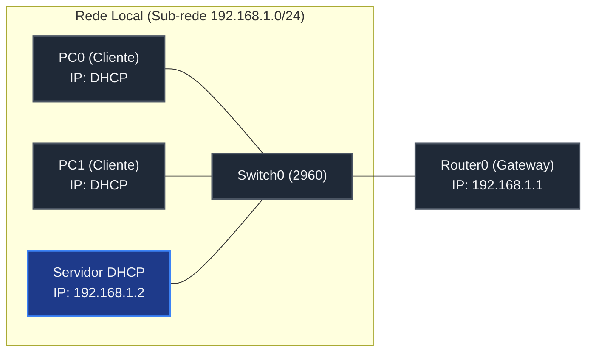

# 🟢 Aula 12: Servidor DHCP Dedicado no Packet Tracer e Ubuntu Server

**Disciplina:** Redes de Computadores I (Cód. RED-01)  
**Curso:** Engenharia / TI — Uniube  
**Semana:** 12 | 08/06/2026  
**Professor:** Romualdo Mathias Filho  
**Tipo:** 🔬 Teórico-Prática (Unificada)  
**Tópicos:** Simulação DHCP no Packet Tracer, Implantação no Ubuntu Server, Instalação e Análise com Wireshark.

---

> [!INFO] 🎯 Visão Geral da Aula & Recursos
> **Aprenda a implantar e auditar serviços DHCP tanto em ambientes de simulação profissional quanto em servidores de produção reais.** Nesta aula, configuraremos um servidor DHCP dedicado em uma rede local no Cisco Packet Tracer e avançaremos para a instalação, configuração e fixação de IPs em um servidor real rodando Ubuntu Server 22.04 LTS com o `isc-dhcp-server`, monitorando e auditando o processo de alocação dinâmica DORA por meio de captura de pacotes no Wireshark.
> 
> * **O que você vai dominar:**
>   - Simular um servidor DHCP dedicado (Server-PT) distribuindo IPs dinâmicos a múltiplos segmentos locais no Cisco Packet Tracer.
>   - Fixar endereços IP estáticos no Linux utilizando arquivos de especificação YAML do `netplan`.
>   - Instalar e configurar o daemon `isc-dhcp-server` no Ubuntu Server 22.04 LTS.
>   - Capturar e analisar o ciclo DORA no Wireshark, auditando campos de Camada 2, 3 e 4.
> * **Pré-requisitos:** [[Aula 10 e Aula 11 - Enderecamento IP DHCP e Pratica Wireshark|Aula 10/11 (Conceitos DHCP e DORA)]].
> * **📂 Recursos Adicionais para Download:**
>   - [[../../40_Recursos/cheatsheet_dhcp_linux.pdf|Cheatsheet de Configuração do DHCP Server no Debian/Ubuntu (PDF)]]
>   - Cenário Packet Tracer com Servidor Dedicado (.pkt): [https://github.com/rofilho/redes1/labs/aula12_dhcp_server.pkt](https://github.com/rofilho/redes1/labs/aula12_dhcp_server.pkt)

---

## 🎯 Objetivo da Aula

Ao final desta aula, os alunos serão capazes de:
- **Configurar** o serviço DHCP em um servidor dedicado no Cisco Packet Tracer para alocação automática de IPs.
- **Fixar** endereços IPv4 no Ubuntu Server através da configuração de rede estruturada no utilitário Netplan.
- **Instalar** e gerenciar o pacote daemon `isc-dhcp-server` no Ubuntu Server para distribuição de escopos dinâmicos.
- **Verificar** o status e os logs de concessões ativas do servidor DHCP real para fins de troubleshooting e auditoria.
- **Auditar** o fluxo DORA no Wireshark mapeando cabeçalhos Ethernet, IP, UDP e Bootstrap.

---

## 🔄 Revisão Rápida (5 min)

| **Conceito (Aulas Anteriores)** | **Conexão com a Aula de Hoje** |
| :--- | :--- |
| **[[Aula 10 e Aula 11 - Enderecamento IP DHCP e Pratica Wireshark\|Aula 10 e 11 (DHCP e Wireshark)]]** | Estudamos o ciclo DHCP DORA (*Discover, Offer, Request, ACK*) e capturamos pacotes via cliente local. Hoje, assumiremos o papel do administrador, configurando servidores de distribuição. |
| **[[Aula 09 - Redes Virtuais VMs ISOs e Hyper-V\|Aula 09 (Redes Virtuais e VMs)]]** | Aprendemos a criar e configurar VMs e comutadores virtuais. Usaremos esse conhecimento para criar a rede interna isolada para testes do nosso servidor Ubuntu. |
| **[[Aula 06 - Pratica Enderecamento IPv4 e Sub-redes Packet Tracer\|Aula 06 (Prática Packet Tracer)]]** | Mapeamos planos de endereçamento em topologias locais. Hoje, automatizaremos a distribuição destes blocos via DHCP Server dedicado. |

---

## 📌 1. Simulação de Servidor DHCP Dedicado no Packet Tracer [Hands-On ⏳ 20 min]

Em redes corporativas de médio e grande porte, a função de servidor DHCP é frequentemente delegada a **servidores dedicados** (como servidores Windows Server ou Linux dedicados) em vez de ser processada diretamente na CPU dos roteadores de borda. Isso centraliza a gerência e libera recursos de hardware do roteador.

No Cisco Packet Tracer, simulamos este cenário utilizando o dispositivo **Server-PT**.



### 🔧 Roteiro de Configuração Passo a Passo:

1. **Abra o Packet Tracer** e monte a seguinte topologia física:
   - **1x Router (modelo 2911)**
   - **1x Switch (modelo 2960)**
   - **1x Servidor (Server-PT)**
   - **2x PCs Clientes**
   - Interligue todos os dispositivos ao Switch usando cabos de cobre direto (Straight-Through).
2. **Configuração do Gateway (Router0):**
   - Acesse a CLI do roteador e ative a interface GigabitEthernet0/0 com o IP do gateway padrão:
```ios
Router> enable
Router# configure terminal
Router(config)# interface GigabitEthernet0/0
Router(config-if)# ip address 192.168.1.1 255.255.255.0
Router(config-if)# no shutdown
Router(config-if)# exit
```
3. **Configuração IP Estático no Servidor DHCP:**
   - Clique no Servidor $\rightarrow$ aba **Desktop** $\rightarrow$ **IP Configuration**.
   - Defina as seguintes configurações estáticas (o próprio servidor DHCP precisa ter IP fixo):
     - **IP Address:** `192.168.1.2`
     - **Subnet Mask:** `255.255.255.0`
     - **Default Gateway:** `192.168.1.1`
4. **Configuração do Serviço DHCP no Servidor:**
   - Acesse a aba **Services** (Serviços) do Servidor $\rightarrow$ selecione **DHCP** na barra lateral.
   - **Ative o serviço** selecionando a opção **On**.
   - Configure o pool de endereços padrão (*serverPool*):
     - **Default Gateway:** `192.168.1.1`
     - **Starting IP Address:** `192.168.1.10`
     - **Subnet Mask:** `255.255.255.0`
     - **Maximum number of Users:** `50`
   - Clique no botão **Save** para atualizar o pool.
5. **Configuração dos Clientes (PCs):**
   - Acesse o **PC0** $\rightarrow$ aba **Desktop** $\rightarrow$ **IP Configuration** $\rightarrow$ selecione **DHCP**.
   - Observe a mensagem *"DHCP request successful"* e valide se o PC recebeu o primeiro IP utilizável do escopo (`192.168.1.10`).
   - Repita o procedimento no **PC1** e confirme que ele recebeu o IP subsequente (`192.168.1.11`).
   - Abra o Command Prompt do PC0 e valide a conectividade executando `ping 192.168.1.11` e `ping 192.168.1.1`.

> [!NOTE] 💼 Pergunta de Entrevista
> **[Pergunta de Redes Corporativas]**: O que é um **DHCP Relay Agent** (Agente de Retransmissão DHCP) e por que ele é crucial em redes divididas por VLANs e roteadores?
> 
> **Resposta Esperada:** Mensagens DHCP Discover são enviadas via Broadcast de Camada 3 (`255.255.255.255`). Como os roteadores barram tráfego de broadcast por padrão para evitar tempestades de rede, clientes localizados em outras sub-redes físicas nunca alcançariam um servidor DHCP centralizado. O DHCP Relay Agent (configurado em switches L3 ou interfaces de roteadores via comando `ip helper-address` no Cisco IOS) intercepta os broadcasts DHCP locais, converte-os em pacotes Unicast direcionados e os encaminha diretamente ao endereço IP do Servidor DHCP remoto, permitindo centralizar a distribuição de IPs de milhares de computadores em um único servidor.

---

### 🧠 Checkpoint: Teste seu Conhecimento!

<details>
<summary><b>🔍 Exercício Rápido: Por que configuramos o escopo de IPs começando em 192.168.1.10 e não em 192.168.1.1?</b></summary>
<blockquote>

**Resposta Correta:** Configurar o ponto inicial em `192.168.1.10` deixa a faixa inicial (`192.168.1.1` a `192.168.1.9`) reservada para atribuição estática manual de infraestrutura (como interfaces de roteador/gateways, switches gerenciáveis, impressoras de rede e o próprio servidor DHCP). Se o pool cobrisse toda a sub-rede a partir do IP `.1`, o servidor poderia alocar dinamicamente o IP do gateway (`192.168.1.1`) para uma estação de trabalho comum, gerando um conflito de IP crítico e derrubando a comunicação externa de toda a rede local.

</blockquote>
</details>

---

## 📌 2. Implantação de Servidor DHCP no Ubuntu Server [Hands-On ⏳ 25 min]

Para simular um cenário real de datacenter, instalaremos e configuraremos um servidor de DHCP corporativo em uma máquina virtual rodando **Ubuntu Server 22.04 LTS**.

### ⚙️ Topologia do Ambiente Virtual:
- **VM 1: Servidor DHCP** (Ubuntu Server com duas placas de rede: `eth0` em modo Bridge/NAT para acesso à Internet e `eth1` em modo Rede Interna para servir os clientes).
- **VM 2: Cliente** (Qualquer SO configurado na mesma Rede Interna virtual).

---

### 🚀 Passo 1: Atualizar o Sistema e Pacotes
Acesse o terminal do Ubuntu Server e execute a atualização das listas de repositórios e pacotes locais:
```bash
sudo apt update && sudo apt upgrade -y
```

---

### 🚀 Passo 2: Fixar Endereço IP com Netplan
No Ubuntu Server moderno, as interfaces de rede são configuradas via **Netplan** com arquivos de sintaxe YAML estruturada localizados em `/etc/netplan/`.

1. Liste e identifique suas interfaces de rede ativas:
```bash
ip a
```
*(Suponha que suas interfaces sejam identificadas como `eth0` e `eth1`).*

2. Abra o arquivo de configuração de rede (substitua o nome do arquivo YAML com base no retorno do comando `{tab}`):
```bash
sudo nano /etc/netplan/00-installer-config.yaml
```

3. Configure a interface `eth1` para ter IP estático (gateway da rede local que distribuirá DHCP):
```yaml
network:
  version: 2
  renderer: networkd
  ethernets:
    eth0:
      dhcp4: yes
    eth1:
      dhcp4: no
      addresses:
        - 192.168.1.1/24
      nameservers:
        addresses: [127.0.0.1]
```

> [!IMPORTANT]
> A sintaxe YAML é extremamente sensível a recuos e espaços. **NUNCA use a tecla TAB** para indentação. Use espaços consecutivos (2 ou 4 espaços por nível).

4. Aplique a configuração de rede e valide o novo endereço IP:
```bash
sudo netplan apply
ip a show eth1
```

---

### 🚀 Passo 3: Instalar o Servidor DHCP (`isc-dhcp-server`)
O pacote padrão para fornecimento de DHCP em sistemas Debian/Ubuntu é o `isc-dhcp-server`. Instale-o via gerenciador de pacotes `apt`:
```bash
sudo apt install isc-dhcp-server -y
```
*(Nota: O serviço tentará iniciar automaticamente e reportará erro. Isto é normal, pois o arquivo de configuração padrão ainda não está configurado).*

---

### 🚀 Passo 4: Configurar o Arquivo Principal `dhcpd.conf`
O arquivo `/etc/dhcp/dhcpd.conf` define o escopo, tempos de aluguel (*lease time*) e parâmetros de rede que o daemon distribuirá aos clientes.

1. Faça um backup de segurança do arquivo original antes de editá-lo:
```bash
sudo mv /etc/dhcp/dhcpd.conf /etc/dhcp/dhcpd.conf.bak
```

2. Crie e edite um novo arquivo limpo:
```bash
sudo nano /etc/dhcp/dhcpd.conf
```

3. Cole a seguinte configuração estruturada:
```text
option domain-name "exemplo.local";
option domain-name-servers 8.8.8.8, 8.8.4.4;

default-lease-time 600;
max-lease-time 7200;

subnet 192.168.1.0 netmask 255.255.255.0 {
  range 192.168.1.10 192.168.1.100;
  option routers 192.168.1.1;
  option broadcast-address 192.168.1.255;
  option subnet-mask 255.255.255.0;
}
```

---

### 🚀 Passo 5: Mapear a Interface de Escuta do Servidor
Devemos instruir explicitamente o servidor DHCP em qual placa de rede física ele deve escutar requisições de broadcast.

1. Abra o arquivo de variáveis do serviço:
```bash
sudo nano /etc/default/isc-dhcp-server
```

2. Localize a variável `INTERFACESv4` e preencha com a interface correspondente à rede interna (no nosso caso, `eth1`):
```text
INTERFACESv4="eth1"
```

---

### 🚀 Passo 6: Iniciar e Validar o Serviço DHCP
Ative o daemon e configure-o para inicializar junto com o sistema operacional:

```bash
sudo systemctl restart isc-dhcp-server
sudo systemctl enable isc-dhcp-server
```

Valide se o serviço está executando sem erros com o status operacional `active (running)`:
```bash
sudo systemctl status isc-dhcp-server
```

---

### 🚀 Passo 7: Testar a Alocação com VM Cliente
1. Acesse uma VM configurada na mesma rede interna virtual (Switch Virtual).
2. Configure a placa de rede da VM cliente para obter endereço IP dinamicamente (DHCP).
3. No console do cliente, force a renovação e verifique se obteve o IP com os comandos:
   - **No Linux Cliente:** `sudo dhclient -v` seguido de `ip a`.
   - **No Windows Cliente:** `ipconfig /renew` seguido de `ipconfig`.
4. No Servidor Ubuntu DHCP, você pode monitorar em tempo real quem alugou IPs visualizando o arquivo de concessões:
```bash
cat /var/lib/dhcp/dhcpd.leases
```

> [!WARNING] ⚠️ Gotcha de Infraestrutura
> O erro mais frequente na inicialização do `isc-dhcp-server` é declarar uma `subnet` no arquivo `dhcpd.conf` que **não possui correspondência de rede direta com nenhuma interface física configurada**. Se a placa `eth1` estiver com o IP `192.168.10.1/24` e você configurar a subnet no arquivo como `192.168.1.0/24`, o daemon reportará falha crítica no syslog: *"No subnet declaration for eth1 (no IPv4 addresses)"* e recusará iniciar.

---

## 📌 3. Instalação do Wireshark e Monitoramento Passo a Passo [Hands-On ⏳ 15 min]

Para entender a jornada exata dos dados na rede física, utilizaremos a ferramenta de análise de pacotes **Wireshark** para monitorar e decodificar cada uma das 4 etapas do ciclo **DORA**.

```
    [CLIENTE]                                                  [SERVIDOR]
    (0.0.0.0)                                               (192.168.1.1)
        |                                                         |
        | ------ DHCP DISCOVER (Src: 0.0.0.0, Dst: 255.255.255.255) ----> | (Broadcast L3)
        | <----- DHCP OFFER (Src: 192.168.1.1, Dst: 192.168.1.10) ------- | (Unicast/Bcast)
        | ------ DHCP REQUEST (Src: 0.0.0.0, Dst: 255.255.255.255) -----> | (Broadcast L3)
        | <----- DHCP ACK (Src: 192.168.1.1, Dst: 192.168.1.10) --------- | (Unicast/Bcast)
        v                                                         v
```

### 🔧 Roteiro Prático de Instalação e Captura:

1. **Instale o Wireshark na máquina de testes (Cliente):**
   - **No Windows:** Baixe e execute o instalador padrão do site oficial ou use o instalador de pacotes:
```cmd
winget install Wireshark.Wireshark
```
   - **No Ubuntu Desktop:** Instale via terminal:
```bash
sudo apt update && sudo apt install wireshark -y
```
2. **Inicie a Captura de Pacotes:**
   - Abra o Wireshark como administrador (no Linux, rode `sudo wireshark`).
   - Destaque e dê um duplo clique na sua interface de rede conectada à rede de testes (ex: `eth1` ou `Ethernet`).
   - No campo de filtro na barra superior, digite **`bootp`** (filtro nativo do Wireshark que engloba tráfego DHCP) e aperte **Enter**.
3. **Força a Transmissão de Tráfego DHCP:**
   - Abra o terminal do cliente de rede e envie comandos para liberar e readquirir o IP:
   - **No Windows:**
```cmd
ipconfig /release
ipconfig /renew
```
   - **No Linux:**
```bash
sudo dhclient -r
sudo dhclient
```
4. **Analise o Passo a Passo (O Fluxo DORA Decodificado):**

#### A. Passo 1 — DHCP Discover (Descoberta):
- Selecione o primeiro pacote da lista (DHCP Discover).
- Expanda a seção **Ethernet II** e observe o MAC de destino: `ff:ff:ff:ff:ff:ff` (Broadcast Físico).
- Expanda a seção **Internet Protocol Version 4**:
  - **Source (Origem):** `0.0.0.0` (O cliente ainda não tem IP configurado).
  - **Destination (Destino):** `255.255.255.255` (Broadcast Lógico).
- Expanda a seção **User Datagram Protocol (UDP)**:
  - **Source Port:** `68` (Porta do Cliente DHCP).
  - **Destination Port:** `67` (Porta do Servidor DHCP).
- Expanda a seção **Bootstrap Protocol (DHCP)** e vá até **DHCP Message Type**: `Discover (1)`.

#### B. Passo 2 — DHCP Offer (Oferta):
- Selecione o segundo pacote capturado.
- Verifique que a origem IP mudou para `192.168.1.1` (IP do servidor DHCP) e o destino IP é o IP que está sendo oferecido ao cliente.
- Expanda a seção **Bootstrap Protocol**:
  - Localize o campo **Your (client) IP address (yiaddr)**: `192.168.1.10` (Este é o endereço reservado que está sendo proposto).

#### C. Passo 3 — DHCP Request (Solicitação):
- Note que o terceiro pacote também é um **Broadcast** (`Dst: 255.255.255.255`).
- *Por que broadcast se a oferta já foi feita?* O cliente envia em broadcast para informar a **todos os servidores DHCP** da rede local que aceitou a oferta do Servidor X, permitindo que outros servidores DHCP eventuais cancelem suas ofertas reservadas e liberem esses IPs de volta aos seus pools.
- Expanda a seção **Bootstrap Protocol** $\rightarrow$ **DHCP Option (50) Requested IP Address**: `192.168.1.10`.

#### D. Passo 4 — DHCP ACK (Confirmação):
- Selecione o último pacote.
- O servidor confirma a concessão enviando o pacote final contendo a máscara, gateway e DNS definidos, gravando o lease permanentemente.

> [!TIP] 💡 Dica de Produção (Pro-Tip)
> Em infraestruturas corporativas, a vulnerabilidade mais comum em ambientes locais é a introdução acidental de um **Rogue DHCP Server** (servidor DHCP clandestino). Isso ocorre quando um funcionário traz de casa um roteador Wi-Fi doméstico e o pluga incorretamente na rede do escritório (usando a porta LAN em vez da WAN). O roteador começa a responder mais rápido que o servidor oficial aos broadcasts DHCP locais, entregando ranges de IPs incorretos e paralisando as estações de trabalho. Para prevenir isso, os engenheiros de infraestrutura ativam a funcionalidade de **DHCP Snooping** nos Switches de acesso, que bloqueia mensagens do tipo DHCP Offer/ACK em todas as portas físicas, exceto nas portas previamente configuradas como "Confiáveis" (Trusted Ports), conectadas aos servidores de produção oficiais.

---

## 📋 Resumo Estrutural

| **Conceito / Comando** | **Definição e Aplicação Prática em Uma Frase** |
| :--- | :--- |
| **Server-PT (Packet Tracer)** | Nó simulador que emula múltiplos serviços de rede dedicados (DHCP, DNS, HTTP) em um único servidor físico. |
| **Netplan** | Utilitário de configuração de rede moderno do Ubuntu que lê especificações YAML para gerenciar interfaces. |
| **netplan apply** | Comando executado no console Linux para carregar e aplicar as alterações feitas no arquivo YAML do Netplan. |
| **isc-dhcp-server** | Pacote daemon que implementa o serviço de DHCP no ambiente Linux Debian/Ubuntu. |
| **dhcpd.conf** | Arquivo principal de configuração onde são definidos parâmetros globais, sub-redes e ranges de distribuição DHCP. |
| **default-lease-time** | Tempo limite padrão (em segundos) que um endereço IP concedido pertence ao cliente antes de necessitar renovação. |
| **dhcpd.leases** | Arquivo de banco de dados do servidor que registra a relação ativa de IPs alocados e seus respectivos MAC addresses. |
| **Filter `bootp`** | Expressão de filtragem utilizada no Wireshark para isolar pacotes Bootstrap/DHCP do tráfego geral da interface. |

---

%%
## ❓ Banco de Questões

> 🔒 *Esta seção é visível apenas no Obsidian do professor. Não publicada para os alunos no Quartz.*

### Questão 1 (Múltipla Escolha — Nível: Intermediário)
**Enunciado:** Um administrador de rede instalou o pacote `isc-dhcp-server` no Ubuntu Server 22.04 LTS para atender a rede interna conectada à placa de rede `eth1` (`192.168.1.1/24`). Após iniciar o serviço com o comando `systemctl start isc-dhcp-server`, o status retornou `failed` (falha). Ao depurar o log do syslog via `journalctl -xeu isc-dhcp-server`, ele localizou a seguinte mensagem de erro:
`No subnet declaration for eth1 (no IPv4 addresses).`
Ao verificar o arquivo `/etc/dhcp/dhcpd.conf`, ele constatou que a configuração estava escrita da seguinte forma:
```text
subnet 192.168.10.0 netmask 255.255.255.0 {
  range 192.168.10.10 192.168.10.50;
  option routers 192.168.10.1;
}
```
Qual é a causa raiz da falha na inicialização do daemon DHCP?

- [ ] A) A porta UDP 67/68 está bloqueada pelas regras de firewall UFW nativas do Ubuntu Server.
- [ ] B) O daemon isc-dhcp-server requer obrigatoriamente que a placa de rede de escuta esteja operando em modo DHCP cliente.
- [x] C) O endereço IP da interface `eth1` (`192.168.1.1`) pertence a uma rede lógica diferente da declarada na diretiva `subnet` (`192.168.10.0/24`) do arquivo de configuração do serviço. ✅
- [ ] D) Falta declarar a diretiva `option domain-name-servers` dentro do escopo do pool configurado.

**Justificativa:** O servidor DHCP (daemon `dhcpd`) precisa necessariamente ter uma interface de rede local ativa configurada com um IP fixo que pertença à mesma faixa lógica da sub-rede declarada no arquivo `/etc/dhcp/dhcpd.conf`. Como a interface `eth1` está configurada com IP `192.168.1.1` e a subnet no arquivo foi declarada como `192.168.10.0/24`, o servidor não consegue associar o escopo de distribuição a nenhuma placa de rede de escuta ativa, resultando em erro crítico de inicialização.

---

### Questão 2 (Múltipla Escolha — Nível: Avançado)
**Enunciado:** Engenheiros da equipe SRE do **iFood** estão investigando um problema intermitente na rede local corporativa de desenvolvimento. Várias estações de trabalho estão obtendo endereços IP na faixa `192.168.88.X` com gateway `192.168.88.1`, impossibilitando o acesso às sub-redes reais e servidores internos da empresa (faixa `10.100.0.0/16`). O administrador de TI verificou que não há nenhum pool configurado na rede corporativa distribuindo a faixa `192.168.88.X`. Com base nos conceitos de segurança física e lógica de redes, o que está ocorrendo nesta infraestrutura e qual a solução definitiva a ser aplicada pelos analistas?

- [ ] A) Ocorreu uma tempestade de broadcast de Camada 2 (Loop físico de rede), forçando a pilha TCP/IP a usar endereços de Autoconfiguração de IP Privado Dinâmico (APIPA).
- [ ] B) O servidor DHCP oficial teve seu arquivo `/var/lib/dhcp/dhcpd.leases` corrompido e deve ter o serviço reiniciado.
- [ ] C) Um servidor de DNS secundário clandestino está interceptando as mensagens DHCP Request e reescrevendo o cabeçalho IP.
- [x] D) Há um Rogue DHCP Server (Servidor DHCP Clandestino) ativo na rede local física. Para solucionar definitivamente, o administrador deve ativar a funcionalidade DHCP Snooping nos switches de distribuição da empresa, configurando apenas a porta conectada ao servidor DHCP legítimo como confiável (Trusted). ✅

**Justificativa:** O comportamento relatado indica a presença de um *Rogue DHCP Server* na rede. Isso geralmente ocorre quando um usuário conecta um roteador doméstico a uma tomada de rede de forma incorreta (pluga a LAN do roteador na rede da empresa). O roteador começa a responder às requisições DHCP Discover mais rapidamente que o servidor corporativo legítimo. A mitigação definitiva de Camada 2 contra esse vetor de ataque é a ativação do *DHCP Snooping* nos Switches Cisco/HP. Essa feature inspeciona o tráfego DHCP e descarta mensagens do tipo DHCP Offer e DHCP ACK vindas de portas não configuradas explicitamente como confiáveis (Trusted Ports).

---

### Questão 3 (Dissertativa — Nível: Avançado)
**Enunciado:** Durante um exercício laboratorial utilizando o Wireshark, um estudante coletou o tráfego da placa de rede local enquanto forçava uma renovação de IP (`ipconfig /renew`). Ao analisar a tabela de pacotes capturados, ele percebeu uma anomalia nas duas primeiras mensagens do ciclo DHCP DORA (Discover e Offer) capturadas em seu computador:
- **Discover:** Source IP: `0.0.0.0`, Destination IP: `255.255.255.255`.
- **Offer:** Source IP: `192.168.1.1` (Servidor DHCP), Destination IP: `192.168.1.10` (IP oferecido).
Explique detalhadamente:
1. Como o pacote **Offer** conseguiu ser entregue com sucesso à máquina do estudante, dado que o destino IP do pacote consta como `192.168.1.10`, mas a placa de rede do cliente ainda **não possui** formalmente esse endereço IP atribuído em sua interface (pois isso só ocorre após o ACK)?
2. A nível de Camada 2 (Link de Enlace), diferencie o método de transmissão e o MAC de destino utilizados na entrega física de frames do pacote Discover e do pacote Offer neste cenário.

**Resposta esperada:**
1. **Mecanismo de Entrega de IP Temporário:** Como o cliente ainda não tem o IP atribuído formalmente, ele não responderia à requisição ARP (Address Resolution Protocol) solicitando a resolução física do endereço IP `192.168.1.10` (que é o processo padrão de Camada 2 para envio IP comum). Portanto, para viabilizar a entrega do pacote *DHCP Offer*, os servidores DHCP e a pilha IP do roteador utilizam uma rota especial baseada no MAC do cliente contida dentro do payload Bootstrap do pacote original (campo `chaddr` - *Client Hardware Address*). O servidor envia o pacote direcionado diretamente ao MAC físico do cliente (Unicast físico) mesmo rotulando o IP de destino com o IP proposto, permitindo que a placa de rede do cliente intercepte e processe o frame na Camada de Enlace sem a necessidade de resolução ARP prévia. Alguns servidores também podem optar por enviar a mensagem Offer como Broadcast total de Camada 3 (`255.255.255.255`), forçando todas as estações a receberem o frame, mas apenas o cliente correspondente ao MAC no payload aceitará a mensagem.
2. **Comparativo L2 (Discover vs. Offer):**
   - **Discover:** Utiliza **Broadcast físico total** na Camada de Enlace. O endereço MAC de destino do frame Ethernet é preenchido obrigatoriamente com o endereço especial de broadcast `ff:ff:ff:ff:ff:ff`. Todos os switches locais inundarão todas as suas portas ativas com este frame, garantindo que o servidor DHCP de escuta receba o pacote.
   - **Offer:** Dependendo da implementação do servidor DHCP e da flag de broadcast solicitada pelo cliente, a mensagem é entregue utilizando **Unicast físico** (MAC de destino é o endereço físico exclusivo da placa do cliente, ex: `3c:7c:3f:1a:2b:3c` obtido no campo `chaddr` do discover) ou **Broadcast físico** (`ff:ff:ff:ff:ff:ff` para garantir que o cliente sem IP a leia). Na maioria das stacks de datacenter modernas, o Unicast é priorizado para evitar poluição desnecessária de tráfego na rede física.

---
%%

## 📄 Artigo de Aprofundamento

- [Ubuntu Server Documentation — DHCP Server](https://ubuntu.com/server/docs/network-dhcp)
> *Resumo prático: Documentação oficial do Ubuntu detalhando a instalação, parametrização e comandos de administração do serviço `isc-dhcp-server` em datacenters.*

---

## 📚 Referências Bibliográficas

- **TANENBAUM, Andrew S.; FEAMSTER, Nicholas; WETHERALL, David J.** *Redes de Computadores*. 6. ed. São Paulo: Pearson, 2021. **(Capítulo 5: A Camada de Rede — Protocolos de Autoconfiguração, pp. 340–345)**.
- **KUROSE, James F.; ROSS, Keith W.** *Redes de computadores e a internet: uma abordagem top-down*. 8. ed. São Paulo: Pearson Education do Brasil, 2021. **(Capítulo 4: Camada de Rede: Plano de Dados — Configuração Automática de Hosts, pp. 245–250)**.
- **CISCO NETWORKING ACADEMY.** *Curso CCNA v7: Switching, Routing, and Wireless Essentials (SRWE)*. Cisco Press, 2020. **(Módulo 7: DHCPv4 — Escopos, pools e relays em topologias corporativas)**.

---
*Última atualização: 2026-06-08 | Status: publicado*
